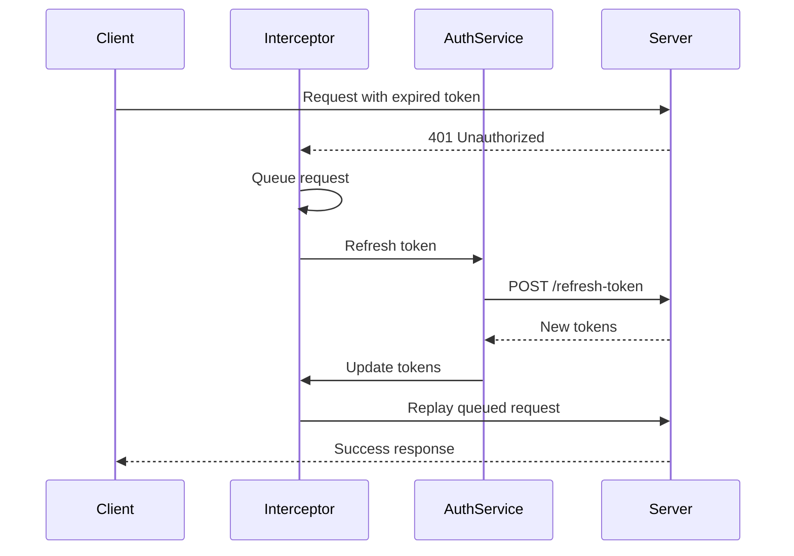

# API Layer Documentation

This document provides comprehensive documentation of the API layer, including HTTP client configuration, interceptors, services, and error handling.

---

## 1. HTTP Client Configuration

### 1.1 Axios Instance

**File:** `lib/api/client.ts`

| Setting | Value |
|---------|-------|
| Base URL | Empty in dev (relative), configurable in prod |
| Timeout | 300,000ms (5 minutes) |
| Content-Type | `application/json` |

### 1.2 Instance Creation

```typescript
import { createApiClient } from '@/lib/api/client'

const apiClient = createApiClient()
```

---

## 2. Request Interceptors

Request interceptors are executed in order before each HTTP request.

**File:** `lib/api/interceptors/request.ts`

### 2.1 Debug Interceptor

| Property | Value |
|----------|-------|
| When | Development only |
| Action | Logs request method, URL, body |

### 2.2 Rate Limit Interceptor

| Property | Value |
|----------|-------|
| When | Always |
| Action | Client-side rate limiting to prevent server overload |

### 2.3 Auth Interceptor

| Property | Value |
|----------|-------|
| When | Always |
| Action | Adds `Authorization: Bearer {token}` header |
| Source | `authStore.accessToken` |

### 2.4 Transform Interceptor

| Property | Value |
|----------|-------|
| When | Always |
| Action | Request data transformation |

### 2.5 Cache Control Interceptor

| Property | Value |
|----------|-------|
| When | Always |
| Action | Adds cache-related headers |

### 2.6 Request Metadata Interceptor

| Property | Value |
|----------|-------|
| When | Always |
| Headers Added | See below |

**Headers:**
- `X-Request-ID`: Unique request identifier
- `X-Client-Timestamp`: Request timestamp
- `X-Client-User-Agent`: Browser info
- `X-App-Version`: Application version

---

## 3. Response Interceptors

Response interceptors are executed in order after each HTTP response.

**File:** `lib/api/interceptors/response.ts`

### 3.1 Cache Response Interceptor

| Property | Value |
|----------|-------|
| When | GET requests |
| Action | Stores successful responses for caching |

### 3.2 Response Transform Interceptor

| Property | Value |
|----------|-------|
| When | Always |
| Action | Unwraps response data |

### 3.3 Error Response Interceptor

| Property | Value |
|----------|-------|
| When | Error responses |
| Actions | See below |

**Error Handling:**
- **401**: Trigger token refresh
- **4xx/5xx**: Normalize to `AppError`
- **Network**: Create `NetworkError`

### 3.4 Token Refresh Flow



---

## 4. API Services

### 4.1 AuthService

**File:** `lib/api/services/AuthService.ts`

| Method | Endpoint | Request | Response |
|--------|----------|---------|----------|
| `login(credentials)` | POST `/api/authentication/login` | `LoginRequestDTO` | `LoginResponseDTO` |
| `refreshToken(access, refresh)` | POST `/api/authentication/refresh-token` | tokens | `LoginResponseDTO` |
| `getProfile(email)` | GET `/api/authentication/profile?email=` | query param | `UserDTO` |
| `forgottenPassword(email)` | PATCH `/api/authentication/forgotten-password` | email | void |
| `setPassword(token, password)` | PATCH `/api/authentication/set-password` | token + password | void |

### 4.2 ChatService

**File:** `lib/api/services/ChatService.ts`

| Method | Endpoint | Request | Response |
|--------|----------|---------|----------|
| `sendQuestion(request)` | POST `/api/AIWebAPI/question/text` | `AiQuestionRequestDTO` | `AISessionMessageDTO` |
| `getWelcomeMessage(request)` | POST `/api/AIWebAPI/welcomeText` | agent info | `AIWelcomeMessageDTO` |
| `getSessionHeaders(request)` | POST `/api/AIWebAPI/GetSessionHeadersByUserId` | user info | `AISessionHeaderDTO[]` |
| `getSessionById(sessionId)` | POST `/api/AIWebAPI/GetSessionById` | session ID | `AISessionDTO` |
| `updateSessionName(request)` | POST `/api/AIWebAPI/SetSessionName` | session + name | void |
| `deleteSession(request)` | POST `/api/AIWebAPI/DeleteSessionById` | session ID | void |
| `rateMessage(request)` | POST `/api/AIWebAPI/SetSessionMessageRating` | message + rating | void |
| `markMessagesRead()` | POST `/api/AIWebAPI/Set_SessionMessagesRead` | message IDs | void |
| `getUnreadMessages(request)` | POST `/api/AIWebAPI/GetUnreadMessages` | user info | `GetUnreadMessagesDTO` |
| `startPublicChat(request)` | POST `/api/AIWebAPI/startPublicChat` | users + agents | `AIPublicChatStartDTO` |
| `addUserToSession(request)` | POST `/api/AIWebAPI/AddUserToSession` | session + user | void |
| `removeUserFromSession(request)` | POST `/api/AIWebAPI/RemoveUserFromSession` | session + user | void |

### 4.3 UserService

**File:** `lib/api/services/UserService.ts`

| Method | Endpoint | Request | Response |
|--------|----------|---------|----------|
| `getSelectableUsers(email)` | GET `/api/user/get-selectable-users?email=` | query param | `UserDTO[]` |

### 4.4 ConfigService

**File:** `lib/api/services/ConfigService.ts`

| Method | Endpoint | Description |
|--------|----------|-------------|
| `getConfig()` | GET `/api/settings/config.json` | Lazy-loaded with promise caching |
| `getCachedConfig()` | - | Returns cached config |
| `refreshConfig()` | GET `/api/settings/config.json` | Force refresh |
| `clearCache()` | - | Clear cached config |

### 4.5 LogService

**File:** `lib/api/services/LogService.ts`

| Method | Description |
|--------|-------------|
| `log(logInfo)` | Generic log entry |
| `debug(message, context?)` | Debug level log |
| `info(message, context?)` | Info level log |
| `warn(message, context?)` | Warning level log |
| `error(message, error?, context?)` | Error level log |
| `logUserAction(action, details?)` | User action tracking |
| `logApiRequest(method, url, status, duration)` | API request logging |
| `logPerformance(metric, value)` | Performance metrics |
| `logChatInteraction(type, sessionId, details?)` | Chat analytics |
| `logAuthEvent(event, email?, details?)` | Auth event tracking |
| `logSignalREvent(event, details?)` | SignalR event tracking |
| `logErrorBoundary(error, componentName)` | Error boundary catches |
| `logFeatureUsage(feature, details?)` | Feature usage analytics |
| `logSystemInfo()` | System information |

---

## 5. Error Handling

### 5.1 Error Class Hierarchy

**File:** `lib/errors/types.ts`

```
AppError (base)
├── ValidationError (400)
├── UnauthorizedError (401)
├── ForbiddenError (403)
├── NotFoundError (404)
├── ServerError (5xx)
├── NetworkError (no response)
├── TimeoutError (timeout)
├── TokenExpiredError (token issues)
└── SignalRConnectionError (WebSocket issues)
```

### 5.2 AppError Class

```typescript
class AppError extends Error {
  code: ErrorCode
  statusCode?: number
  details?: Record<string, unknown>
}
```

### 5.3 Error Normalization

**File:** `lib/errors/normalize.ts`

The `normalizeApiError()` function:
- Converts any error type to `AppError`
- Handles AxiosError, Error, unknown
- Preserves stack traces

### 5.4 Result Pattern Usage

All service methods return `Result<T, AppError>` using the `neverthrow` library:

```typescript
import { ok, err, Result } from 'neverthrow'

async function fetchData(): Promise<Result<Data, AppError>> {
  try {
    const response = await apiClient.get('/endpoint')
    return ok(response.data)
  } catch (error) {
    return err(normalizeApiError(error))
  }
}

// Usage
const result = await AuthService.login(credentials)
if (result.isErr()) {
  // Handle error: result.error
  console.error(result.error.message)
} else {
  // Use data: result.value
  const data = result.value
}
```

### 5.5 Error Codes

```typescript
enum ErrorCode {
  UNKNOWN = 'UNKNOWN',
  NETWORK_ERROR = 'NETWORK_ERROR',
  TIMEOUT = 'TIMEOUT',
  UNAUTHORIZED = 'UNAUTHORIZED',
  FORBIDDEN = 'FORBIDDEN',
  NOT_FOUND = 'NOT_FOUND',
  VALIDATION_ERROR = 'VALIDATION_ERROR',
  SERVER_ERROR = 'SERVER_ERROR',
  TOKEN_EXPIRED = 'TOKEN_EXPIRED',
  SIGNALR_ERROR = 'SIGNALR_ERROR'
}
```

---

## 6. API Proxy Configuration

### 6.1 Development Proxy (Nitro)

**File:** `nuxt.config.ts`

```typescript
routeRules: {
  '/api/**': { proxy: 'http://localhost:8082/api/**' },
  '/chatHub/**': { proxy: 'http://localhost:8082/chatHub/**' },
  '/assets/**': { proxy: 'http://localhost:8082/assets/**' }
}
```

### 6.2 Production

- Direct API calls to configured `NUXT_PUBLIC_API_BASE_URL`
- No proxy needed

### 6.3 Environment Variables

| Variable | Default | Description |
|----------|---------|-------------|
| `NUXT_PUBLIC_API_BASE_URL` | (empty) | API base URL for production |
| `NUXT_PROXY_TARGET` | `http://localhost:8082` | Dev proxy target |

---

## 7. Request/Response DTOs

### 7.1 Authentication

```typescript
interface LoginRequestDTO {
  email: string
  password: string  // SHA512 hashed
}

interface LoginResponseDTO {
  accessToken: string
  refreshToken: string
  user: UserDTO
}
```

### 7.2 Chat

```typescript
interface AiQuestionRequestDTO {
  sessionId: string
  agentId: string
  questionText: string
  questionType: AIQuestionType
}

interface AISessionMessageDTO {
  id: string
  sessionId: string
  senderId: string
  senderName: string
  content: string
  answerType: AIAnswerType
  createdAt: string
  rating?: number
}
```

See [TYPES.md](./TYPES.md) for complete type definitions.

---

## 8. Zod Validation

**File:** `types/api/schemas.ts`

All DTOs have corresponding Zod schemas for runtime validation:

```typescript
import { z } from 'zod'

const LoginRequestSchema = z.object({
  email: z.string().email(),
  password: z.string().min(1)
})

// Validate API response
const parsed = LoginResponseSchema.safeParse(response.data)
if (!parsed.success) {
  return err(new ValidationError('Invalid response'))
}
return ok(parsed.data)
```

**Features:**
- Lowercase enum transformation (backend sends lowercase)
- Optional field handling
- Date string validation

---

## Related Documentation

- [STATE.md](./STATE.md) - State management with Vue Query
- [TYPES.md](./TYPES.md) - Complete type definitions
- [CONVENTIONS.md](./CONVENTIONS.md) - API coding patterns
