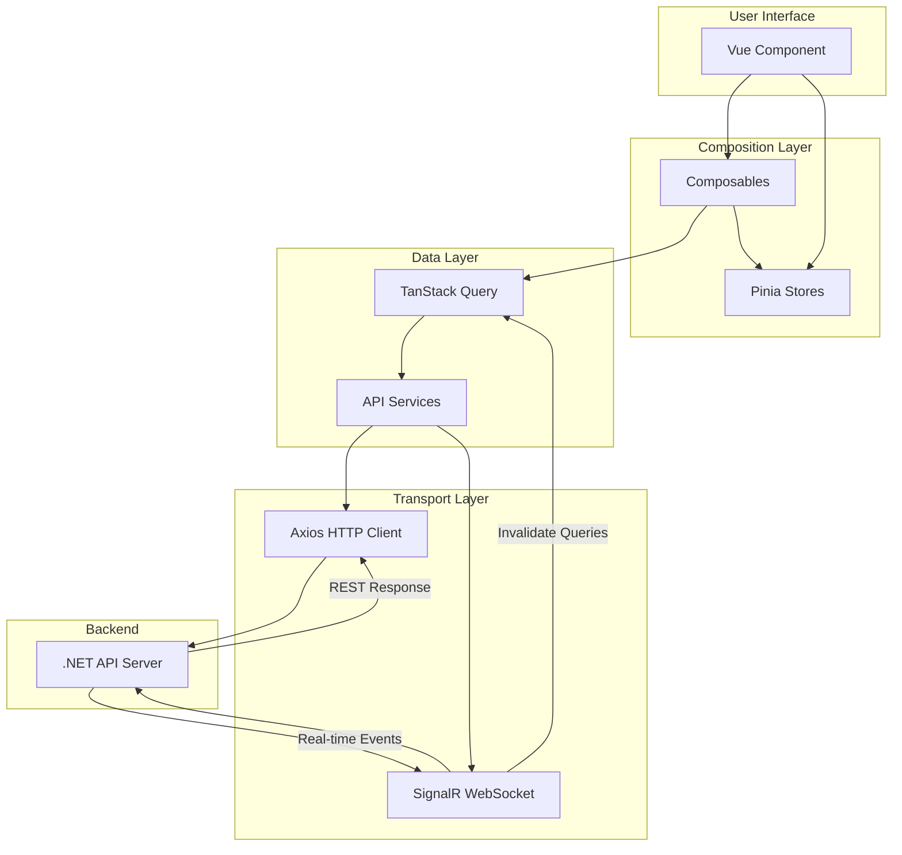

# Architecture Overview

This document provides a comprehensive overview of the Vonno system architecture, technology stack, and codebase organization.

---

## Project Type & Purpose

| Attribute | Value |
|-----------|-------|
| **Application Type** | Single Page Application (SPA) with SSR disabled |
| **Primary Purpose** | AI-powered multi-user chat platform with virtual agents |
| **PWA Support** | Full offline support with service worker caching |
| **Target Platforms** | Web browsers (Chrome, Firefox, Safari, Edge) + Mobile PWA |

---

## Technology Stack

### Core Framework

| Package | Version | Purpose |
|---------|---------|---------|
| `nuxt` | 4.2.0 | Vue meta-framework for SPA/SSR |
| `vue` | 3.5.22 | Reactive UI framework |
| `vue-router` | 4.6.3 | Client-side routing |
| `typescript` | 5.6.3 | Static type checking |

### State Management

| Package | Version | Purpose |
|---------|---------|---------|
| `@pinia/nuxt` | 0.11.2 | Vue 3 store solution |
| `pinia-plugin-persistedstate` | 4.5.0 | localStorage persistence |
| `@tanstack/vue-query` | 5.90.5 | Server state management |

### API & Real-Time

| Package | Version | Purpose |
|---------|---------|---------|
| `axios` | 1.13.1 | HTTP client |
| `@microsoft/signalr` | 9.0.6 | WebSocket real-time communication |

### UI Framework

| Package | Version | Purpose |
|---------|---------|---------|
| `@nuxt/ui` | 4.1.0 | Component library (Radix + Tailwind) |
| `@nuxt/icon` | 2.1.0 | Icon system |
| `lucide-vue-next` | 0.552.0 | Icon set |
| `@radix-icons/vue` | 1.0.0 | Radix icon set |
| `tailwindcss` | 4.1.17 | Utility-first CSS |
| `@tailwindcss/typography` | 0.5.15 | Prose styling |
| `tailwindcss-animate` | 1.0.7 | Animation utilities |

### Validation & Error Handling

| Package | Version | Purpose |
|---------|---------|---------|
| `zod` | 4.1.12 | Runtime schema validation |
| `neverthrow` | 8.2.0 | Result-based error handling |

### Content Rendering

| Package | Version | Purpose |
|---------|---------|---------|
| `markdown-it` | 14.1.0 | Markdown parsing |
| `shiki` | 1.25.0 | Code syntax highlighting |
| `katex` | 0.16.25 | LaTeX math rendering |
| `dompurify` | 3.2.2 | HTML sanitization (XSS prevention) |
| `markdown-it-texmath` | 1.0.0 | Math in markdown |

### Authentication

| Package | Version | Purpose |
|---------|---------|---------|
| `jwt-decode` | 4.0.0 | JWT token parsing |
| `js-sha512` | 0.9.0 | Password hashing |

### Utilities

| Package | Version | Purpose |
|---------|---------|---------|
| `@vueuse/core` | 14.0.0 | Vue composition utilities |
| `@vueuse/nuxt` | 14.0.0 | Nuxt integration for VueUse |
| `clsx` | 2.1.1 | Conditional classNames |
| `class-variance-authority` | 0.7.1 | Component variant styling |
| `tailwind-merge` | 3.4.0 | Tailwind class merging |

### PWA & i18n

| Package | Version | Purpose |
|---------|---------|---------|
| `@vite-pwa/nuxt` | 1.0.7 | PWA support with Workbox |
| `@nuxtjs/i18n` | 10.2.1 | Internationalization |

### Dev Dependencies

| Package | Version | Purpose |
|---------|---------|---------|
| `vitest` | 3.2.4 | Unit testing framework |
| `@playwright/test` | 1.56.1 | E2E testing |
| `@testing-library/vue` | 8.1.0 | Component testing utilities |
| `@vue/test-utils` | 2.4.6 | Vue testing utilities |
| `msw` | 2.11.6 | API mocking |
| `happy-dom` | 20.0.10 | DOM simulation for tests |
| `vue-tsc` | 3.1.4 | Vue TypeScript type checking |
| `eslint` | 9.0.0 | Code linting |
| `@nuxt/eslint` | 1.10.0 | Nuxt ESLint integration |

---

## Directory Structure

```
vonno/
├── app/                              # Nuxt 4 application directory
│   ├── app.vue                       # Root Vue component
│   ├── assets/
│   │   └── css/
│   │       └── main.css              # Global CSS with Tailwind imports
│   ├── components/
│   │   ├── chat/
│   │   │   ├── AgentTile.vue         # Agent selection card with animation
│   │   │   ├── ChatMessages.vue      # Message list with date grouping
│   │   │   ├── ManageSessionUsers.vue # Add/remove members modal
│   │   │   ├── MarkdownContent.vue   # Markdown renderer with code highlighting
│   │   │   ├── MessageInput.vue      # Message composer with agent selection
│   │   │   ├── MessageRating.vue     # Thumbs up/down rating UI
│   │   │   ├── SessionItemMenu.vue   # Session context menu (rename/delete)
│   │   │   ├── SessionMembers.vue    # Avatar stack for session members
│   │   │   ├── SignalRConnectionStatus.vue # Connection indicator
│   │   │   ├── TypingIndicator.vue   # "X is typing..." indicator
│   │   │   └── UnreadChatCard.vue    # Unread session summary card
│   │   ├── AppUpdateBanner.vue       # PWA update notification banner
│   │   └── UserAvatar.vue            # User profile picture component
│   ├── composables/
│   │   ├── useAuth.ts                # Authentication helpers
│   │   ├── useChatAutoScroll.ts      # Auto-scroll on new messages
│   │   ├── useChatMutations.ts       # TanStack mutations for chat
│   │   ├── useChatQueries.ts         # TanStack queries for chat data
│   │   ├── useMarkdown.ts            # Markdown rendering logic
│   │   ├── useMutuallyVisibleUsers.ts # Session member filtering
│   │   ├── usePWAUpdate.ts           # PWA update detection
│   │   ├── useSelectableUsers.ts     # User selection for new chats
│   │   ├── useShiki.ts               # Code syntax highlighting
│   │   ├── useSidebar.ts             # Sidebar state & mobile handling
│   │   ├── useSignalR.ts             # SignalR connection wrapper
│   │   └── useSignalRChat.ts         # Chat-specific SignalR events
│   ├── layouts/
│   │   ├── auth.vue                  # Login page layout (centered)
│   │   └── default.vue               # Main app layout with sidebar
│   ├── middleware/
│   │   └── auth.global.ts            # Global authentication guard
│   ├── pages/
│   │   ├── chats/
│   │   │   ├── [sessionId].vue       # Active chat view
│   │   │   ├── index.vue             # Chat list with agents
│   │   │   └── new/
│   │   │       └── [userId].vue      # New chat with specific user
│   │   ├── index.vue                 # Root redirect to /chats
│   │   ├── login.vue                 # Login page
│   │   └── users.vue                 # Users page (placeholder)
│   ├── plugins/
│   │   ├── api-interceptors.client.ts # Axios interceptor setup
│   │   ├── pinia-persistence.client.ts # Store persistence plugin
│   │   ├── signalr-init.client.ts    # SignalR auto-connect on login
│   │   ├── ssr-width.ts              # SSR width detection
│   │   └── vue-query.client.ts       # TanStack Query client setup
│   ├── stores/
│   │   ├── auth.ts                   # Authentication Pinia store
│   │   └── chat.ts                   # Chat UI state Pinia store
│   ├── types/                        # App-specific types
│   └── utils/                        # App-specific utilities
├── lib/                              # Shared library code
│   ├── api/
│   │   ├── client.ts                 # Axios instance factory
│   │   ├── setup.ts                  # Interceptor wiring & initialization
│   │   ├── interceptors/
│   │   │   ├── request.ts            # Request interceptor chain
│   │   │   └── response.ts           # Response interceptor chain
│   │   ├── services/
│   │   │   ├── AuthService.ts        # Authentication API service
│   │   │   ├── ChatService.ts        # Chat/messaging API service
│   │   │   ├── ConfigService.ts      # Runtime config service
│   │   │   ├── LogService.ts         # Client-side logging service
│   │   │   └── UserService.ts        # User management API service
│   │   └── utils/
│   │       └── tokens.ts             # Token utility functions
│   ├── errors/
│   │   ├── normalize.ts              # Error normalization function
│   │   └── types.ts                  # AppError class hierarchy
│   ├── signalr/
│   │   ├── index.ts                  # SignalR exports
│   │   ├── SignalROperations.ts      # Hub method invocations
│   │   ├── SignalRService.ts         # Singleton SignalR connection
│   │   └── types.ts                  # SignalR type definitions
│   ├── types/
│   │   └── chat/                     # Chat-related types
│   ├── utils/
│   │   └── chat/                     # Chat utility functions
│   └── validation/
│       └── chat/                     # Chat validation schemas
├── types/                            # Global TypeScript types
│   ├── api/
│   │   ├── base.ts                   # Base API response types
│   │   ├── log-types.ts              # Logging types
│   │   └── schemas.ts                # Zod schemas for all DTOs
│   └── enums/
│       └── index.ts                  # All application enums
├── i18n/
│   └── locales/
│       ├── en.json                   # English translations
│       └── hu.json                   # Hungarian translations
├── tests/
│   ├── e2e/                          # Playwright E2E tests
│   ├── unit/                         # Vitest unit tests
│   ├── mocks/                        # MSW mock handlers
│   ├── setup.ts                      # Test setup file
│   └── utils.ts                      # Test utilities
├── public/
│   └── icons/                        # PWA icons (various sizes)
├── bruno/                            # Bruno API testing collection
├── agent-os/                         # AI agent-related code
├── nuxt.config.ts                    # Nuxt configuration
├── app.config.ts                     # UI theme configuration
├── vitest.config.ts                  # Unit test configuration
├── playwright.config.ts              # E2E test configuration
├── eslint.config.mjs                 # ESLint configuration
├── tsconfig.json                     # TypeScript configuration
├── components.json                   # Nuxt UI components config
└── package.json                      # Dependencies & scripts
```

---

## Architectural Patterns

### 1. Composition API Pattern

All Vue components use the Composition API with `<script setup lang="ts">`. Logic is extracted into composables (`use*.ts`) for reusability.

**Example:**
```typescript
// app/composables/useAuth.ts
export function useAuth() {
  const authStore = useAuthStore()

  const isAuthenticated = computed(() => authStore.isAuthenticated)
  const user = computed(() => authStore.user)

  return { isAuthenticated, user }
}
```

### 2. Feature-Based Organization

Components are organized by feature (e.g., `components/chat/`) rather than by type. This keeps related code together.

### 3. Service Layer Pattern

API calls are encapsulated in service classes (`AuthService`, `ChatService`, etc.) that return `Result<T, AppError>` types for explicit error handling.

**Example:**
```typescript
// lib/api/services/AuthService.ts
export class AuthService {
  static async login(credentials: LoginRequestDTO): Promise<Result<LoginResponseDTO, AppError>> {
    try {
      const response = await apiClient.post('/api/authentication/login', credentials)
      return ok(response.data)
    } catch (error) {
      return err(normalizeApiError(error))
    }
  }
}
```

### 4. Interceptor Chain Pattern

HTTP requests/responses pass through configurable interceptor chains for cross-cutting concerns (auth, caching, logging, error handling).

### 5. Result-Based Error Handling

Using `neverthrow` library, all service methods return `Result<T, E>` instead of throwing exceptions. This enforces explicit error handling at call sites.

### 6. Query Key Factory Pattern

TanStack Query keys are generated via factory functions (`chatQueryKeys`) to ensure consistency and enable targeted cache invalidation.

```typescript
const chatQueryKeys = {
  all: ['chat'],
  sessions: () => [...chatQueryKeys.all, 'sessions'],
  session: (id: string) => [...chatQueryKeys.sessions(), id],
}
```

### 7. Singleton Service Pattern

Services like `SignalRService` use singleton pattern to maintain single connection instance across the application.

---

## Data Flow Architecture



### Data Flow Description

1. **User Interface Layer**: Vue components handle user interactions and display
2. **Composition Layer**: Composables provide reusable logic; Pinia stores manage local state
3. **Data Layer**: TanStack Query manages server state caching; API Services handle HTTP calls
4. **Transport Layer**: Axios handles REST; SignalR handles real-time WebSocket
5. **Backend**: .NET API server processes requests and broadcasts real-time events

---

## Module Dependencies

```mermaid
graph LR
    subgraph "Nuxt Modules"
        A[@vite-pwa/nuxt]
        B[@vueuse/nuxt]
        C[@pinia/nuxt]
        D[@nuxt/eslint]
        E[@nuxt/ui]
        F[@nuxt/icon]
        G[@nuxt/test-utils]
        H[@nuxtjs/i18n]
    end

    subgraph "Core Libraries"
        I[vue]
        J[vue-router]
        K[pinia]
        L[axios]
        M[signalr]
    end

    subgraph "Utility Libraries"
        N[zod]
        O[neverthrow]
        P[vueuse]
    end

    C --> K
    B --> P
    E --> I
```

---

## Key Configuration Files

| File | Purpose |
|------|---------|
| `nuxt.config.ts` | Nuxt configuration (modules, PWA, i18n, proxy) |
| `app.config.ts` | UI theme configuration |
| `tsconfig.json` | TypeScript compiler options |
| `vitest.config.ts` | Unit test configuration |
| `playwright.config.ts` | E2E test configuration |
| `eslint.config.mjs` | Linting rules |

---

## Related Documentation

- [FEATURES.md](./FEATURES.md) - Feature specifications
- [API.md](./API.md) - API layer details
- [STATE.md](./STATE.md) - State management
- [CONVENTIONS.md](./CONVENTIONS.md) - Code conventions
