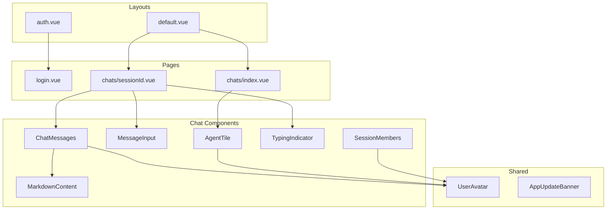

# UI Component Reference

This document provides comprehensive documentation of all UI components in the Vonno application.

---

## 1. Nuxt UI Components

The application uses Nuxt UI 4.1.0 as its component library. Below are the Nuxt UI components used:

| Component | Usage |
|-----------|-------|
| `UButton` | Primary actions, submit buttons |
| `UInput` | Text inputs, search fields |
| `UTextarea` | Message input |
| `UCard` | Container cards |
| `UAlert` | Error/success messages |
| `UIcon` | Icon rendering |
| `UAvatar` | User avatars |
| `UBadge` | Unread counts |
| `USkeleton` | Loading placeholders |
| `UCheckbox` | Remember me, selection |
| `UAccordion` | Sidebar sections |
| `UDashboard*` | Layout components |
| `UDropdownMenu` | Context menus |
| `UModal` | Modal dialogs |

---

## 2. Chat Components

### 2.1 ChatMessages.vue

**File:** `app/components/chat/ChatMessages.vue`

**Purpose:** Display message list with date grouping

#### Props

| Prop | Type | Description |
|------|------|-------------|
| `messages` | `AISessionMessageDTO[]` | Messages to display |
| `currentUserId` | `string` | Current user for alignment |

#### Features

- Groups messages by date
- Different styling for own vs others' messages
- Displays sender name and timestamp
- Renders markdown content via `MarkdownContent`
- Shows message status indicators

---

### 2.2 MessageInput.vue

**File:** `app/components/chat/MessageInput.vue`

**Purpose:** Message composer with agent selection

#### Props

| Prop | Type | Description |
|------|------|-------------|
| `sessionId` | `string` | Target session |
| `agents` | `UserDTO[]` | Available agents |

#### Emits

| Event | Payload | Description |
|-------|---------|-------------|
| `send` | `{ text, agentId }` | Message sent |

#### Features

- Auto-resizing textarea
- Agent selection buttons (toggle)
- Draft auto-save on unmount
- Error display with retry button
- Typing indicator emission
- Responsive rows (1 on mobile, 3 on desktop)

---

### 2.3 MarkdownContent.vue

**File:** `app/components/chat/MarkdownContent.vue`

**Purpose:** Render markdown with syntax highlighting

#### Props

| Prop | Type | Description |
|------|------|-------------|
| `content` | `string` | Markdown text |

#### Features

- markdown-it rendering
- Shiki code syntax highlighting
- KaTeX math equations
- DOMPurify sanitization
- Safe regex patterns (ReDoS prevention)

---

### 2.4 AgentTile.vue

**File:** `app/components/chat/AgentTile.vue`

**Purpose:** Agent selection card

#### Props

| Prop | Type | Description |
|------|------|-------------|
| `agent` | `UserDTO` | Agent data |
| `selected` | `boolean` | Selection state |

#### Emits

| Event | Payload | Description |
|-------|---------|-------------|
| `select` | `void` | Tile clicked |

#### Features

- Avatar display
- Hover animations (scale, outline)
- Selection indicator
- Dark/light mode avatar switching

---

### 2.5 UnreadChatCard.vue

**File:** `app/components/chat/UnreadChatCard.vue`

**Purpose:** Session summary with unread count

#### Props

| Prop | Type | Description |
|------|------|-------------|
| `session` | `AISessionHeaderDTO` | Session data |
| `unreadCount` | `number` | Unread messages |

#### Features

- Avatar stack of participants
- Session name
- Relative date
- Unread badge

---

### 2.6 TypingIndicator.vue

**File:** `app/components/chat/TypingIndicator.vue`

**Purpose:** "X is typing..." display

#### Props

| Prop | Type | Description |
|------|------|-------------|
| `users` | `string[]` | Typing user names |

#### Features

- Animated three-dot indicator
- Multi-user formatting
- i18n support

---

### 2.7 SessionMembers.vue

**File:** `app/components/chat/SessionMembers.vue`

**Purpose:** Avatar stack for session members

#### Props

| Prop | Type | Description |
|------|------|-------------|
| `members` | `UserDTO[]` | Session members |
| `max` | `number` | Max avatars shown |

#### Features

- Stacked avatars with overlap
- Overflow indicator (+N)
- Tooltip on hover

---

### 2.8 ManageSessionUsers.vue

**File:** `app/components/chat/ManageSessionUsers.vue`

**Purpose:** Add/remove members modal

#### Props

| Prop | Type | Description |
|------|------|-------------|
| `sessionId` | `string` | Target session |
| `currentMembers` | `UserDTO[]` | Current members |

#### Emits

| Event | Payload | Description |
|-------|---------|-------------|
| `close` | `void` | Modal closed |

#### Features

- User search
- Add/remove buttons
- Member list
- Loading states

---

### 2.9 SessionItemMenu.vue

**File:** `app/components/chat/SessionItemMenu.vue`

**Purpose:** Session context menu (dropdown)

#### Props

| Prop | Type | Description |
|------|------|-------------|
| `session` | `AISessionHeaderDTO` | Session data |

#### Features

- Rename option
- Delete option
- Manage members option
- Disabled for primary sessions

---

### 2.10 SignalRConnectionStatus.vue

**File:** `app/components/chat/SignalRConnectionStatus.vue`

**Purpose:** Connection status indicator

#### Features

| State | Color | Description |
|-------|-------|-------------|
| Connected | Green | WebSocket active |
| Reconnecting | Yellow | Attempting reconnect |
| Disconnected | Red | No connection |

- Tooltip with status text

---

### 2.11 MessageRating.vue

**File:** `app/components/chat/MessageRating.vue`

**Purpose:** Thumbs up/down rating

#### Props

| Prop | Type | Description |
|------|------|-------------|
| `messageId` | `string` | Message ID |
| `currentRating` | `number \| null` | Current rating value |

#### Emits

| Event | Payload | Description |
|-------|---------|-------------|
| `rate` | `number` | Rating value |

**Note:** Currently hidden in UI

---

## 3. Layout Components

### 3.1 default.vue

**File:** `app/layouts/default.vue`

**Purpose:** Main app layout

#### Features

- Sidebar with navigation
- Accordion sections (Chats, Settings)
- Session list in sidebar
- User menu
- Responsive (slide-over on mobile)
- Back button handling for Android

---

### 3.2 auth.vue

**File:** `app/layouts/auth.vue`

**Purpose:** Login page layout

#### Features

- Centered content
- Gradient background
- Minimal UI
- No sidebar

---

## 4. Shared Components

### 4.1 UserAvatar.vue

**File:** `app/components/UserAvatar.vue`

**Purpose:** User profile picture

#### Props

| Prop | Type | Description |
|------|------|-------------|
| `user` | `UserDTO` | User data |
| `size` | `'sm' \| 'md' \| 'lg'` | Avatar size |

#### Features

- Image with fallback
- Initials if no image
- Status indicator (optional)

---

### 4.2 AppUpdateBanner.vue

**File:** `app/components/AppUpdateBanner.vue`

**Purpose:** PWA update notification

#### Features

- Dismissible banner
- Update button
- Auto-show when update available
- Uses `usePWAUpdate` composable

---

## 5. Component Architecture Diagram



---

## 6. Styling Patterns

### 6.1 Tailwind CSS

All components use Tailwind CSS for styling:

```vue
<template>
  <div class="flex items-center gap-2 p-4 rounded-lg bg-white dark:bg-gray-800">
    <!-- content -->
  </div>
</template>
```

### 6.2 Dark Mode

- Uses Nuxt UI color mode
- Classes: `dark:bg-*`, `dark:text-*`
- Preference stored in `nuxt-color-mode` cookie

### 6.3 Responsive Design

| Breakpoint | Prefix | Width |
|------------|--------|-------|
| Mobile | (default) | < 640px |
| Small | `sm:` | >= 640px |
| Medium | `md:` | >= 768px |
| Large | `lg:` | >= 1024px |
| Extra Large | `xl:` | >= 1280px |

---

## Related Documentation

- [PAGES.md](./PAGES.md) - Page components
- [COMPOSABLES.md](./COMPOSABLES.md) - Component logic
- [CONVENTIONS.md](./CONVENTIONS.md) - Component patterns
