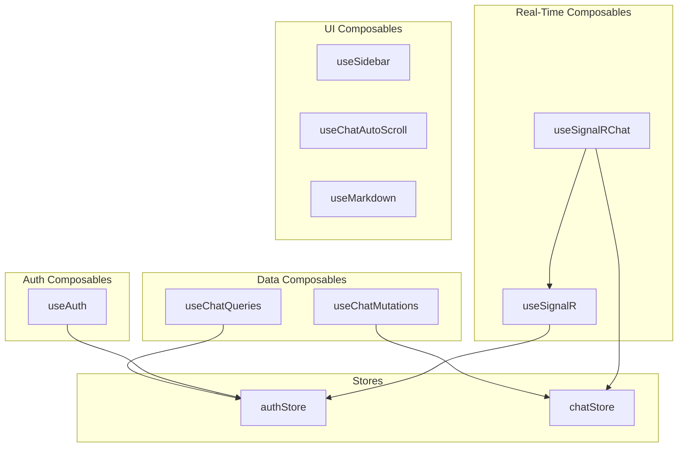

# Composables Reference

This document provides comprehensive documentation of all composables in the Vonno application.

---

## 1. Data Composables

### 1.1 useChatQueries.ts

**File:** `app/composables/useChatQueries.ts`

Provides all TanStack Query hooks for chat data fetching.

#### useChatSessions(options?)

| Property | Value |
|----------|-------|
| Query Key | `['chat', 'sessions']` |
| Endpoint | `POST /api/AIWebAPI/GetSessionHeadersByUserId` |
| Stale Time | 5 minutes |
| Polling | 60 seconds |

```typescript
const { data, isPending, error } = useChatSessions()
```

#### useChatSession(sessionId, options?)

| Property | Value |
|----------|-------|
| Query Key | `['chat', 'sessions', sessionId]` |
| Endpoint | `POST /api/AIWebAPI/GetSessionById` |
| Stale Time | 30 seconds |

```typescript
const { data: session } = useChatSession(sessionId)
```

#### useUnreadMessages()

| Property | Value |
|----------|-------|
| Query Key | `['chat', 'unread']` |
| Endpoint | `POST /api/AIWebAPI/GetUnreadMessages` |
| Polling | 60 seconds |

```typescript
const { data: unreadCounts } = useUnreadMessages()
```

#### useWelcomeMessage(agentId)

| Property | Value |
|----------|-------|
| Query Key | `['chat', 'welcome', agentId]` |
| Endpoint | `POST /api/AIWebAPI/welcomeText` |

```typescript
const { data: welcome } = useWelcomeMessage(agentId)
```

### 1.2 useChatMutations.ts

**File:** `app/composables/useChatMutations.ts`

Provides all TanStack Mutation hooks for chat operations.

#### useSendMessage()

```typescript
const { mutateAsync, isPending } = useSendMessage()

await mutateAsync({
  sessionId: 'session-123',
  agentId: 'agent-456',
  text: 'Hello!'
})
```

#### useUpdateSessionName()

```typescript
const { mutateAsync } = useUpdateSessionName()

await mutateAsync({
  sessionId: 'session-123',
  name: 'New Name'
})
```

#### useDeleteSession()

```typescript
const { mutateAsync } = useDeleteSession()

await mutateAsync('session-123')
```

#### useStartPublicChat()

```typescript
const { mutateAsync } = useStartPublicChat()

const result = await mutateAsync({
  userIds: ['user-1', 'user-2'],
  agentIds: ['agent-1']
})
```

---

## 2. Auth Composables

### 2.1 useAuth()

**File:** `app/composables/useAuth.ts`

#### Returns

| Property | Type | Description |
|----------|------|-------------|
| `isAuthenticated` | `ComputedRef<boolean>` | Auth status |
| `user` | `ComputedRef<UserDTO \| null>` | Current user |
| `login` | `Function` | Login method |
| `logout` | `Function` | Logout method |

```typescript
const { isAuthenticated, user, login, logout } = useAuth()

if (!isAuthenticated.value) {
  await login(email, password, rememberMe)
}
```

---

## 3. Real-Time Composables

### 3.1 useSignalR()

**File:** `app/composables/useSignalR.ts`

#### Returns

| Property/Method | Type | Description |
|-----------------|------|-------------|
| `isConnected` | `ComputedRef<boolean>` | Connection status |
| `isConnecting` | `ComputedRef<boolean>` | Connecting status |
| `isReconnecting` | `ComputedRef<boolean>` | Reconnecting status |
| `connectionId` | `ComputedRef<string \| null>` | Connection ID |
| `lastError` | `ComputedRef<Error \| null>` | Last error |
| `connect()` | `Promise<void>` | Establish connection |
| `disconnect()` | `Promise<void>` | Close connection |
| `onEvent(name, handler)` | `void` | Subscribe to event |
| `off(name, handler)` | `void` | Unsubscribe |
| `emit(name, ...args)` | `Promise<void>` | Send to hub |

```typescript
const { isConnected, onEvent } = useSignalR()

onEvent('ReceiveMessage', (sessionId, agentId) => {
  console.log('New message')
})
```

### 3.2 useSignalRChat()

**File:** `app/composables/useSignalRChat.ts`

Specialized for chat-specific SignalR events.

#### Returns

| Property/Method | Type | Description |
|-----------------|------|-------------|
| `startTyping` | `Function` | Emit typing start |
| `stopTyping` | `Function` | Emit typing stop |

```typescript
const { startTyping, stopTyping } = useSignalRChat(sessionId)

// When user starts typing
startTyping()

// After debounce
stopTyping()
```

---

## 4. UI Composables

### 4.1 useSidebar()

**File:** `app/composables/useSidebar.ts`

#### Returns

| Property | Type | Description |
|----------|------|-------------|
| `isOpen` | `Ref<boolean>` | Sidebar state |
| `isMobile` | `ComputedRef<boolean>` | Mobile detection |
| `toggle` | `Function` | Toggle sidebar |
| `open` | `Function` | Open sidebar |
| `close` | `Function` | Close sidebar |

```typescript
const { isOpen, isMobile, toggle } = useSidebar()

if (isMobile.value) {
  toggle()
}
```

### 4.2 useChatAutoScroll()

**File:** `app/composables/useChatAutoScroll.ts`

#### Parameters

| Param | Type | Description |
|-------|------|-------------|
| `containerRef` | `Ref<HTMLElement>` | Scroll container |
| `messages` | `Ref<Message[]>` | Message list |

#### Behavior

- Scrolls to bottom on new messages
- Respects user scroll position
- Smart scroll detection

```typescript
const containerRef = ref<HTMLElement>()
const { data: session } = useChatSession(sessionId)

useChatAutoScroll(containerRef, computed(() => session.value?.messages ?? []))
```

### 4.3 useMarkdown()

**File:** `app/composables/useMarkdown.ts`

#### Returns

| Property | Type | Description |
|----------|------|-------------|
| `render` | `(content: string) => string` | Sync render |
| `renderAsync` | `(content: string) => Promise<string>` | Async render with highlighting |

```typescript
const { render, renderAsync } = useMarkdown()

const html = render('# Hello')
const htmlWithHighlight = await renderAsync('```js\nconsole.log("hi")\n```')
```

### 4.4 useShiki()

**File:** `app/composables/useShiki.ts`

#### Returns

| Property | Type | Description |
|----------|------|-------------|
| `highlighter` | `Ref<Highlighter \| null>` | Shiki instance |
| `isLoading` | `Ref<boolean>` | Loading state |
| `highlight` | `Function` | Highlight code |

```typescript
const { highlighter, isLoading, highlight } = useShiki()

if (!isLoading.value) {
  const html = highlight('const x = 1', 'javascript')
}
```

### 4.5 usePWAUpdate()

**File:** `app/composables/usePWAUpdate.ts`

#### Returns

| Property | Type | Description |
|----------|------|-------------|
| `needRefresh` | `Ref<boolean>` | Update available |
| `updateServiceWorker` | `Function` | Apply update |
| `close` | `Function` | Dismiss banner |

```typescript
const { needRefresh, updateServiceWorker, close } = usePWAUpdate()

if (needRefresh.value) {
  // Show update banner
  // On click: updateServiceWorker()
  // On dismiss: close()
}
```

---

## 5. Utility Composables

### 5.1 useSelectableUsers()

**File:** `app/composables/useSelectableUsers.ts`

#### Returns

| Property | Type | Description |
|----------|------|-------------|
| `users` | `ComputedRef<UserDTO[]>` | All users |
| `isLoading` | `Ref<boolean>` | Loading state |
| `search` | `Ref<string>` | Search query |
| `filteredUsers` | `ComputedRef<UserDTO[]>` | Filtered list |

```typescript
const { users, search, filteredUsers } = useSelectableUsers()

search.value = 'john'
// filteredUsers now contains only users matching 'john'
```

### 5.2 useMutuallyVisibleUsers()

**File:** `app/composables/useMutuallyVisibleUsers.ts`

#### Parameters

| Param | Type | Description |
|-------|------|-------------|
| `sessionId` | `string` | Session ID |

#### Returns

| Property | Type | Description |
|----------|------|-------------|
| `addableUsers` | `ComputedRef<UserDTO[]>` | Users that can be added |
| `removableUsers` | `ComputedRef<UserDTO[]>` | Users that can be removed |

```typescript
const { addableUsers, removableUsers } = useMutuallyVisibleUsers(sessionId)

// Use in ManageSessionUsers modal
```

---

## 6. Composable Architecture



---

## 7. Composable Patterns

### 7.1 Reactive Parameters

```typescript
// Use computed or ref for reactive parameters
const sessionId = computed(() => route.params.id)
const { data } = useChatSession(sessionId)
```

### 7.2 Cleanup

```typescript
// Composables with event listeners clean up automatically
onMounted(() => {
  const { onEvent, off } = useSignalR()

  const handler = () => { /* ... */ }
  onEvent('ReceiveMessage', handler)

  // Auto-cleanup on unmount
  onUnmounted(() => {
    off('ReceiveMessage', handler)
  })
})
```

### 7.3 Error Handling

```typescript
const { data, error, isPending } = useChatSession(sessionId)

// In template
if (error.value) {
  // Show error
}
```

---

## Related Documentation

- [STATE.md](./STATE.md) - Query/mutation details
- [SIGNALR.md](./SIGNALR.md) - SignalR composables
- [CONVENTIONS.md](./CONVENTIONS.md) - Composable patterns
