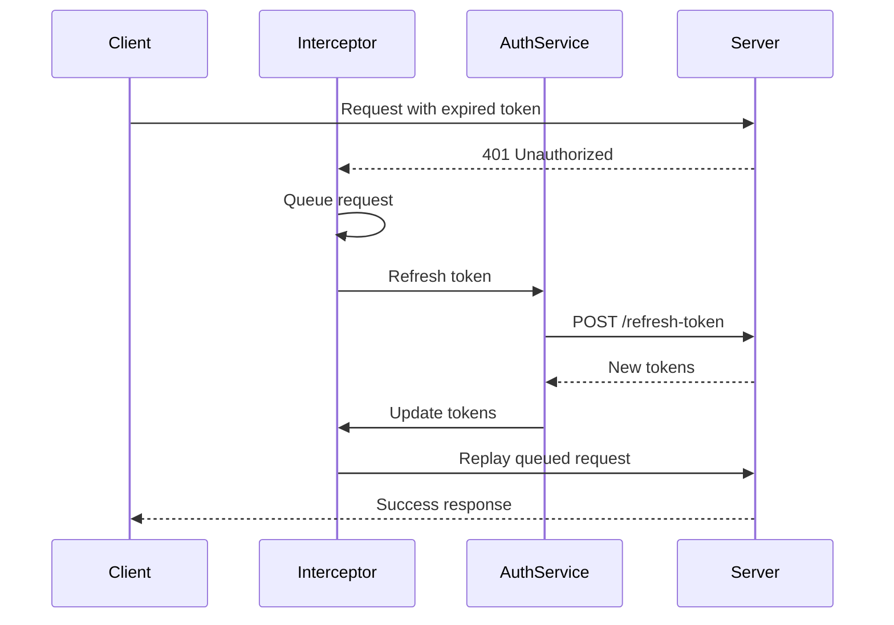
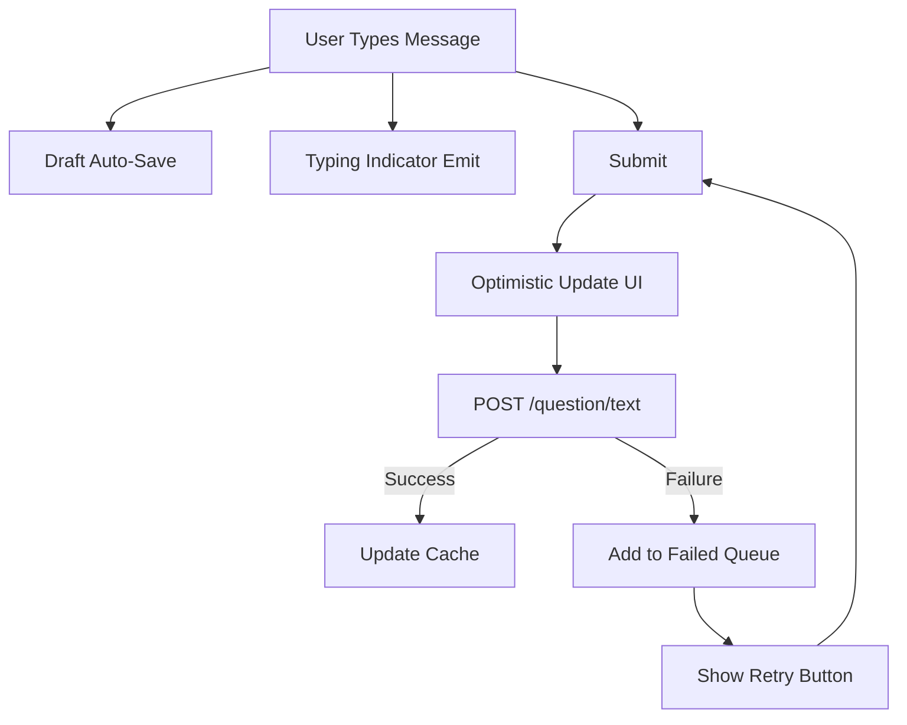

# Feature Specification

This document provides exhaustive documentation of all Vonno features, user flows, and functionality.

---

## 1. Authentication System

### 1.1 Login Flow

1. User enters email and password on `/login` page
2. Password is hashed client-side using SHA512 (`js-sha512`)
3. Credentials sent to `POST /api/authentication/login`
4. Response contains: `accessToken`, `refreshToken`, `user` object
5. Tokens stored in Pinia store with localStorage persistence
6. SignalR connection established automatically after login
7. User redirected to original destination or `/chats`

**Key Files:**
- `app/pages/login.vue` - Login page component
- `app/stores/auth.ts` - Authentication store
- `lib/api/services/AuthService.ts` - Auth API service

### 1.2 Token Management

| Token | Type | Purpose |
|-------|------|---------|
| Access Token | Short-lived JWT | API authentication |
| Refresh Token | Long-lived | Obtaining new access tokens |

**Storage:** Both stored in localStorage via Pinia persistence

**Header:** `Authorization: Bearer {accessToken}` on all requests

### 1.3 Auto Token Refresh



**Flow:**
1. Response interceptor detects 401 errors
2. Queues pending requests while refreshing
3. Calls `POST /api/authentication/refresh-token`
4. Updates stored tokens on success
5. Replays queued requests with new token
6. Logs out user if refresh fails

### 1.4 Remember Me

- Email stored separately in localStorage
- Pre-fills email field on login page
- Controlled by "Remember Me" checkbox

### 1.5 Role-Based Access

| Role | Description | Permissions |
|------|-------------|-------------|
| `User` | Regular user | Can chat, view sessions |
| `Agent` | Virtual AI agent | Automated responses |
| `Admin` | Administrator | Full system access |

### 1.6 Route Protection

- `auth.global.ts` middleware runs on every navigation
- Checks `authStore.isAuthenticated`
- Unauthenticated users redirected to `/login?redirect={originalPath}`
- `/login` page accessible without authentication

### 1.7 Logout Flow

1. `authStore.logout()` called
2. Tokens cleared from store and localStorage
3. SignalR connection closed
4. User redirected to `/login`

---

## 2. Chat Sessions

### 2.1 Session Types

| Type | Description | Characteristics |
|------|-------------|-----------------|
| **Primary** | One-on-one direct message | Cannot rename or delete, auto-created |
| **Group** | Multi-user session | Can rename, delete, add/remove members |

### 2.2 Session CRUD Operations

| Operation | Endpoint | Description |
|-----------|----------|-------------|
| Create | `POST /api/AIWebAPI/startPublicChat` | Create with selected users/agents |
| Read (List) | `POST /api/AIWebAPI/GetSessionHeadersByUserId` | Get all session headers |
| Read (Detail) | `POST /api/AIWebAPI/GetSessionById` | Get session with messages |
| Update | `POST /api/AIWebAPI/SetSessionName` | Rename session |
| Delete | `POST /api/AIWebAPI/DeleteSessionById` | Delete session |

### 2.3 Member Management

| Action | Endpoint |
|--------|----------|
| Add user | `POST /api/AIWebAPI/AddUserToSession` |
| Remove user | `POST /api/AIWebAPI/RemoveUserFromSession` |

**UI Component:** `ManageSessionUsers.vue` modal

### 2.4 Draft Message Persistence

- Draft messages auto-saved to `useChatStore.draftMessages` Map
- Key format: `{sessionId}:{agentId}`
- Persisted to localStorage
- Restored when returning to session

### 2.5 Failed Message Queue

- Failed messages stored in `useChatStore.failedMessages` Map
- Keyed by session ID
- Displayed with retry button in UI
- Persisted to localStorage

---

## 3. AI Agent Integration

### 3.1 Agent Discovery

- Agents loaded from session headers (filtered by `isVirtual: true`)
- Displayed as `AgentTile.vue` cards on `/chats` page
- Animated hover effects (scale, outline)

### 3.2 Agent Selection

- Multiple agents can be selected per session
- Selected agents receive messages
- Toggle selection via agent buttons in `MessageInput.vue`

### 3.3 Welcome Messages

- Fetched via `POST /api/AIWebAPI/welcomeText`
- Displayed when starting new chat with agent
- Cached by TanStack Query

### 3.4 Virtual vs Real Users

| Type | `isVirtual` | Description |
|------|-------------|-------------|
| Real | `false` | Human user |
| Virtual | `true` | AI agent |

---

## 4. Real-Time Messaging

### 4.1 SignalR Integration

| Setting | Value |
|---------|-------|
| Hub URL | `/chatHub` (proxied in dev, full URL in prod) |
| Transport | `LongPolling` for broad compatibility |
| Auto-reconnect | `[0, 1000, 2000, 5000, 10000]ms` delays |

### 4.2 Real-Time Events

| Event | Payload | Action |
|-------|---------|--------|
| `ReceiveMessage` | `sessionId, agentId` | Invalidate session query |
| `SendStartTypingInfo` | `name, email, sessionId` | Show typing indicator |
| `ReceiveStopTypingInfo` | `name, email, sessionId` | Hide typing indicator |

### 4.3 Typing Indicators

- Emitted when user starts typing
- 3-second debounce
- Display formats:
  - "X is typing..."
  - "X and Y are typing..."
  - "X, Y, and Z are typing..."

### 4.4 HTTP Polling Fallback

- TanStack Query polls every 60 seconds
- Activates when SignalR disconnected
- Ensures messages received even without WebSocket

### 4.5 Optimistic Updates

- Messages added to UI immediately on send
- Query cache updated optimistically
- Rolled back on failure

---

## 5. Message Features

### 5.1 Markdown Rendering

| Feature | Implementation |
|---------|----------------|
| Parser | `markdown-it` with plugins |
| Emoji | Support enabled |
| Sanitization | `dompurify` (XSS prevention) |
| Regex | Safe patterns (ReDoS prevention) |

### 5.2 Code Syntax Highlighting

| Feature | Implementation |
|---------|----------------|
| Engine | `shiki` (Rust-based, 190+ languages) |
| Loading | Lazy-loaded highlighter instance |
| Theme | Auto-detected based on color mode |

### 5.3 LaTeX/Math Equations

| Feature | Implementation |
|---------|----------------|
| Engine | `katex` via `markdown-it-texmath` |
| Inline | `$...$` |
| Block | `$$...$$` |

### 5.4 Message Status

| Status | Description |
|--------|-------------|
| `Sending` | Request in flight |
| `Sent` | Server acknowledged |
| `Delivered` | Delivered to recipients |
| `Read` | Recipients have read |
| `Failed` | Send failed, can retry |

### 5.5 Message Rating

- Thumbs up/down feedback
- API: `POST /api/AIWebAPI/SetSessionMessageRating`
- UI: `MessageRating.vue` component (currently hidden)

---

## 6. PWA Features

### 6.1 Service Worker

| Setting | Value |
|---------|-------|
| Register Type | `prompt` (user prompted to update) |
| Skip Waiting | Yes |
| Clients Claim | Yes |

### 6.2 Caching Configuration

| Resource | Strategy | TTL |
|----------|----------|-----|
| Images | CacheFirst | 30 days |
| API | NetworkFirst | 24 hours |
| Static assets | CacheFirst | N/A |

### 6.3 Update Detection

- Periodic sync every 10 minutes
- `usePWAUpdate` composable
- `AppUpdateBanner.vue` for update prompt

### 6.4 Install Prompt

- Automatically shown when installable
- Custom install UI

### 6.5 PWA Manifest

```json
{
  "name": "Vonno - AI Chat Platform",
  "short_name": "Vonno",
  "theme_color": "#283618",
  "display": "standalone",
  "orientation": "portrait"
}
```

---

## 7. Internationalization

### 7.1 Supported Languages

| Code | Name | Default |
|------|------|---------|
| `hu` | Hungarian | Yes |
| `en` | English | No |

### 7.2 Detection Strategy

1. Check `i18n_redirected` cookie
2. Detect browser language
3. Fall back to Hungarian

### 7.3 Translation Keys Structure

```
login.*          - Login form
chat.*           - Chat interface
sidebar.*        - Navigation
errors.*         - Error messages
pwa.*            - PWA notifications
emptyPage.*      - Empty states
```

**Files:**
- `i18n/locales/en.json` - English translations
- `i18n/locales/hu.json` - Hungarian translations

---

## User Flow Diagrams

### Authentication Flow

```mermaid
graph TD
    A[User Visits App] --> B{Authenticated?}
    B -->|No| C[/login]
    B -->|Yes| D[/chats]
    C --> E[Enter Credentials]
    E --> F[SHA512 Hash Password]
    F --> G[POST /api/auth/login]
    G -->|Success| H[Store Tokens]
    H --> I[Connect SignalR]
    I --> D
    G -->|Failure| J[Show Error]
    J --> E
```

### Chat Session Flow

```mermaid
graph TD
    A[/chats] --> B{Select Action}
    B -->|New Chat| C[Select Users/Agents]
    C --> D[POST /startPublicChat]
    D --> E[/chats/:sessionId]
    B -->|Existing Chat| E
    E --> F[Load Messages]
    F --> G[Display Chat]
    G --> H{User Action}
    H -->|Send Message| I[POST /question/text]
    H -->|Manage Members| J[ManageSessionUsers Modal]
    H -->|Rename| K[POST /SetSessionName]
    H -->|Delete| L[POST /DeleteSessionById]
```

### Message Send Flow



---

## Related Documentation

- [API.md](./API.md) - API endpoints and services
- [STATE.md](./STATE.md) - State management details
- [SIGNALR.md](./SIGNALR.md) - Real-time communication
- [COMPONENTS.md](./COMPONENTS.md) - UI components
