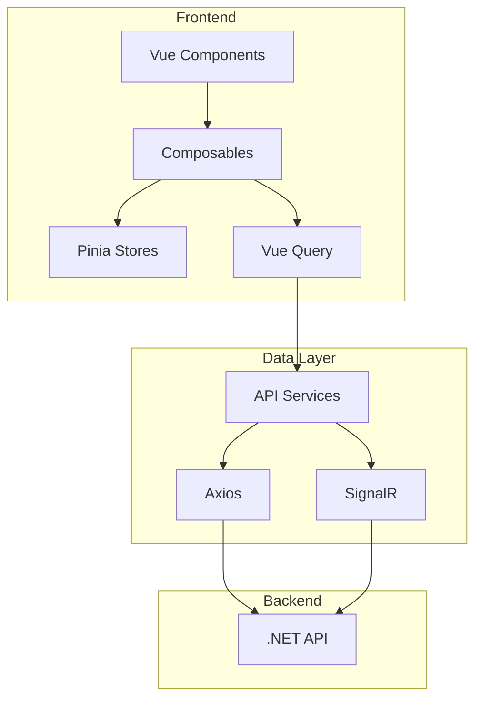

# Vonno AI Chat Platform - Documentation

This documentation provides comprehensive coverage of the Vonno codebase for both AI assistants and human developers.

## Quick Reference

| Document | Purpose |
|----------|---------|
| [ARCHITECTURE.md](./ARCHITECTURE.md) | System architecture, tech stack, directory structure |
| [FEATURES.md](./FEATURES.md) | Feature specifications, user flows |
| [API.md](./API.md) | API layer, services, interceptors, error handling |
| [STATE.md](./STATE.md) | Pinia stores, Vue Query, persistence |
| [SIGNALR.md](./SIGNALR.md) | Real-time WebSocket communication |
| [COMPONENTS.md](./COMPONENTS.md) | UI component reference |
| [PAGES.md](./PAGES.md) | Routing and page documentation |
| [TYPES.md](./TYPES.md) | TypeScript types and Zod schemas |
| [TESTING.md](./TESTING.md) | Vitest and Playwright testing guide |
| [DEVOPS.md](./DEVOPS.md) | Build, deployment, environment config |
| [COMPOSABLES.md](./COMPOSABLES.md) | Composables reference |
| [CONVENTIONS.md](./CONVENTIONS.md) | Code standards and patterns |

---

## Project Overview

**Vonno** is a production-ready AI-powered chat web application (PWA) that enables users to have multi-user chat sessions with virtual AI agents in real-time.

### Tech Stack Summary

| Category | Technology |
|----------|------------|
| Framework | Nuxt 4.2.0 (Vue 3.5.22) |
| Language | TypeScript 5.6.3 (strict) |
| UI | Nuxt UI 4.1.0 + Tailwind CSS 4.1.17 |
| State | Pinia + TanStack Vue Query 5.90.5 |
| Real-time | Microsoft SignalR 9.0.6 |
| Validation | Zod 4.1.12 |
| Error Handling | neverthrow 8.2.0 |
| i18n | Hungarian (default) + English |

### Key Features

- **Authentication**: JWT-based with auto token refresh
- **Chat Sessions**: One-on-one and group chats with AI agents
- **Real-time**: SignalR WebSocket with HTTP polling fallback
- **Markdown**: Full markdown support with code highlighting (Shiki) and LaTeX (KaTeX)
- **PWA**: Offline support, install prompt, periodic updates
- **i18n**: Hungarian and English languages

---

## Directory Structure Overview

```
vonno/
├── app/                    # Nuxt 4 application
│   ├── components/         # Vue components
│   ├── composables/        # Composition API hooks
│   ├── stores/             # Pinia stores
│   ├── pages/              # File-based routing
│   ├── layouts/            # Page layouts
│   ├── middleware/         # Route middleware
│   └── plugins/            # Nuxt plugins
├── lib/                    # Shared library code
│   ├── api/                # HTTP client & services
│   ├── signalr/            # SignalR service
│   └── errors/             # Error handling
├── types/                  # Global TypeScript types
├── i18n/                   # Internationalization
└── tests/                  # Test suites
```

---

## Getting Started

### Development

```bash
npm install
npm run dev
```

### Build

```bash
npm run build
npm run preview
```

### Testing

```bash
npm run test           # Unit tests (Vitest)
npm run test:e2e       # E2E tests (Playwright)
```

---

## Architecture Diagram



---

## Navigation

- **New to the codebase?** Start with [ARCHITECTURE.md](./ARCHITECTURE.md)
- **Implementing features?** See [FEATURES.md](./FEATURES.md) and [COMPONENTS.md](./COMPONENTS.md)
- **Working with APIs?** Check [API.md](./API.md) and [STATE.md](./STATE.md)
- **Adding real-time features?** Read [SIGNALR.md](./SIGNALR.md)
- **Writing tests?** Consult [TESTING.md](./TESTING.md)
- **Following conventions?** Review [CONVENTIONS.md](./CONVENTIONS.md)
