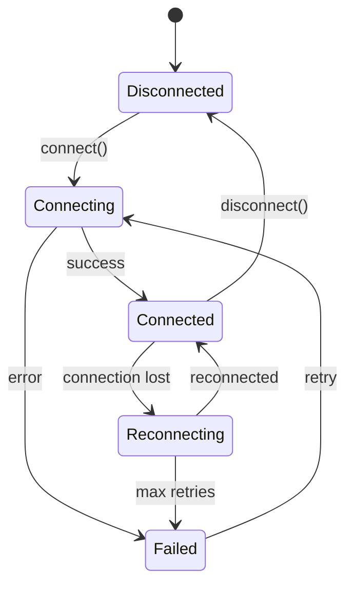
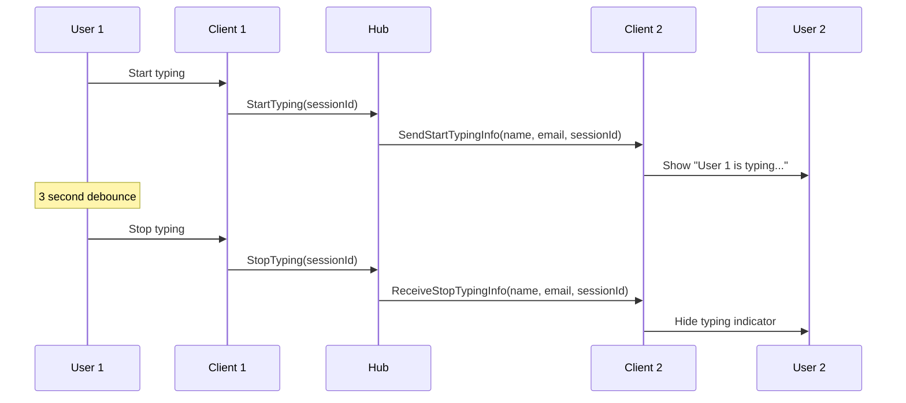

# Real-Time Communication (SignalR)

This document provides comprehensive documentation of the SignalR WebSocket integration for real-time messaging.

---

## 1. SignalR Service Architecture

### 1.1 Service Configuration

**File:** `lib/signalr/SignalRService.ts`

| Setting | Value | Description |
|---------|-------|-------------|
| Transport | LongPolling | Browser compatibility |
| Auto-reconnect | Yes | With delay pattern |
| Reconnect delays | `[0, 1000, 2000, 5000, 10000]` | Exponential backoff (ms) |
| Logging | Information | Production level |

### 1.2 Connection URL

| Environment | URL |
|-------------|-----|
| Development | `/chatHub` (proxied via Nitro) |
| Production | `{NUXT_PUBLIC_API_BASE_URL}/chatHub` |

### 1.3 Singleton Pattern

- Single instance per application
- Created on first access
- Shared across all components
- Automatic lifecycle management

---

## 2. Connection Lifecycle



### 2.1 Connection States

| State | Description |
|-------|-------------|
| `Disconnected` | No active connection |
| `Connecting` | Establishing connection |
| `Connected` | Active connection |
| `Reconnecting` | Lost connection, attempting reconnect |
| `Failed` | Connection failed after max retries |

---

## 3. Hub Events

### 3.1 Incoming Events

| Event | Parameters | Action |
|-------|------------|--------|
| `ReceiveMessage` | `sessionId: string, agentId: string` | Invalidate session + unread queries |
| `SendStartTypingInfo` | `name: string, email: string, sessionId: string` | Add to typing users |
| `ReceiveStopTypingInfo` | `name: string, email: string, sessionId: string` | Remove from typing users |

### 3.2 Outgoing Events

| Event | Parameters | Description |
|-------|------------|-------------|
| `StartTyping` | `sessionId: string` | Notify others of typing |
| `StopTyping` | `sessionId: string` | Stop typing notification |

### 3.3 Connection Events

| Event | Trigger | Action |
|-------|---------|--------|
| `stateChange` | Any state change | Update UI indicators |
| `reconnected` | After reconnection | Refetch all queries |
| `closed` | Connection closed | Show offline indicator |

---

## 4. Composables

### 4.1 useSignalR()

**File:** `app/composables/useSignalR.ts`

#### Returns

| Property/Method | Type | Description |
|-----------------|------|-------------|
| `isConnected` | `ComputedRef<boolean>` | Connection status |
| `isConnecting` | `ComputedRef<boolean>` | Connecting status |
| `isReconnecting` | `ComputedRef<boolean>` | Reconnecting status |
| `connectionId` | `ComputedRef<string \| null>` | Current connection ID |
| `lastError` | `ComputedRef<Error \| null>` | Last error |
| `connect()` | `Promise<void>` | Establish connection |
| `disconnect()` | `Promise<void>` | Close connection |
| `onEvent(name, handler)` | `void` | Subscribe to event |
| `off(name, handler)` | `void` | Unsubscribe |
| `emit(name, ...args)` | `Promise<void>` | Send to hub |

#### Usage

```typescript
const { isConnected, connect, onEvent } = useSignalR()

// Connect
await connect()

// Subscribe to events
onEvent('ReceiveMessage', (sessionId, agentId) => {
  console.log('New message in session', sessionId)
})
```

### 4.2 useSignalRChat()

**File:** `app/composables/useSignalRChat.ts`

#### Responsibilities

- Subscribe to `ReceiveMessage` events
- Manage typing indicators
- Emit typing status
- Integrate with Vue Query cache

#### Usage

```typescript
const { startTyping, stopTyping } = useSignalRChat(sessionId)

// When user starts typing
startTyping()

// When user stops typing (debounced)
stopTyping()
```

---

## 5. Integration with Vue Query

### 5.1 Event → Query Invalidation

| Event | Invalidated Queries |
|-------|---------------------|
| `ReceiveMessage` | `sessions`, `session:{sessionId}`, `unread` |
| `reconnected` | All queries |

### 5.2 Plugin Initialization

**File:** `app/plugins/signalr-init.client.ts`

```typescript
export default defineNuxtPlugin(async () => {
  const authStore = useAuthStore()
  const queryClient = useQueryClient()

  // Auto-connect if authenticated
  if (authStore.isAuthenticated) {
    await signalRService.connect()
  }

  // Setup event listeners
  signalRService.on('ReceiveMessage', (sessionId) => {
    queryClient.invalidateQueries({ queryKey: chatQueryKeys.sessions() })
    queryClient.invalidateQueries({ queryKey: chatQueryKeys.session(sessionId) })
    queryClient.invalidateQueries({ queryKey: chatQueryKeys.unread() })
  })

  // Reconnect handler
  signalRService.on('reconnected', () => {
    queryClient.invalidateQueries()
  })
})
```

---

## 6. Typing Indicators

### 6.1 Flow



### 6.2 Display Format

| Typing Users | Display |
|--------------|---------|
| 1 user | "Alice is typing..." |
| 2 users | "Alice and Bob are typing..." |
| 3+ users | "Alice, Bob, and 2 others are typing..." |

---

## 7. Connection Status UI

**File:** `app/components/chat/SignalRConnectionStatus.vue`

| State | Color | Icon |
|-------|-------|------|
| Connected | Green | Check |
| Reconnecting | Yellow | Refresh |
| Disconnected | Red | X |

---

## 8. Error Handling

### 8.1 Connection Errors

```typescript
class SignalRConnectionError extends AppError {
  code = ErrorCode.SIGNALR_ERROR
}
```

### 8.2 Reconnection Strategy

| Attempt | Delay |
|---------|-------|
| 1 | 0ms (immediate) |
| 2 | 1,000ms |
| 3 | 2,000ms |
| 4 | 5,000ms |
| 5+ | 10,000ms |

### 8.3 Fallback to HTTP Polling

When SignalR is disconnected:
- TanStack Query polls every 60 seconds
- Ensures messages are received
- Less efficient but reliable

---

## 9. Authentication

### 9.1 Token Provider

SignalR connection is established with access token:

```typescript
const connection = new HubConnectionBuilder()
  .withUrl('/chatHub', {
    accessTokenFactory: () => authStore.accessToken
  })
  .build()
```

### 9.2 Token Refresh

- SignalR automatically uses updated token on reconnect
- Token refresh handled by auth store

---

## Related Documentation

- [STATE.md](./STATE.md) - Cache invalidation on events
- [FEATURES.md](./FEATURES.md) - Real-time feature details
- [API.md](./API.md) - REST API fallback
