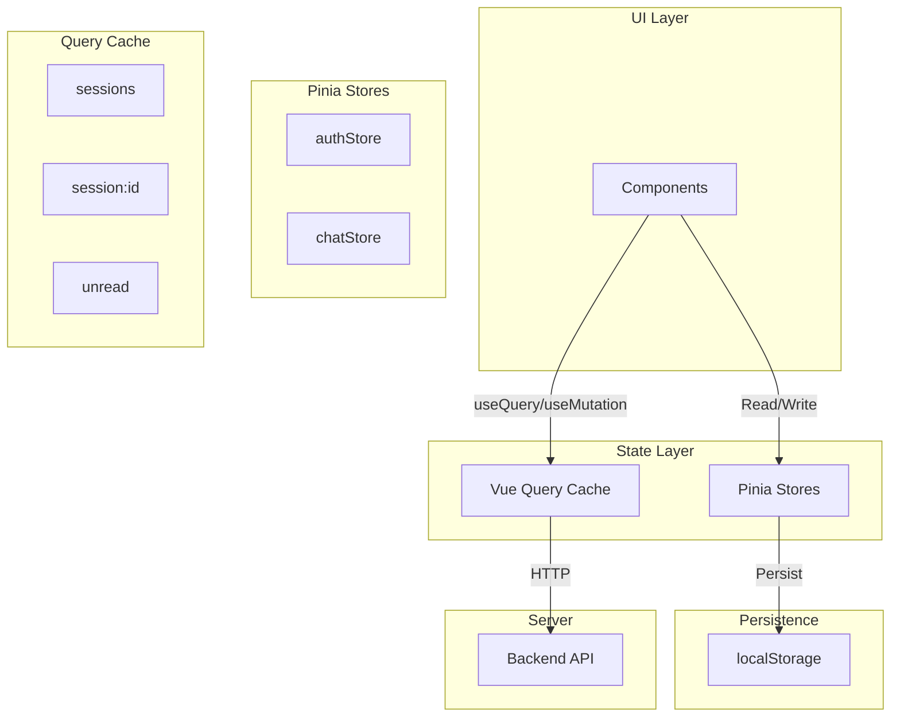

# State Management Documentation

This document provides comprehensive documentation of state management using Pinia stores and TanStack Vue Query.

---

## 1. Pinia Stores

### 1.1 Auth Store

**File:** `app/stores/auth.ts`

#### State

| Property | Type | Description |
|----------|------|-------------|
| `user` | `UserDTO \| null` | Current user |
| `accessToken` | `string \| null` | JWT access token |
| `refreshToken` | `string \| null` | Refresh token |
| `isLoading` | `boolean` | Loading state |
| `lastError` | `AppError \| null` | Last error |

#### Getters

| Getter | Type | Description |
|--------|------|-------------|
| `isAuthenticated` | `boolean` | Has valid token |
| `isAdmin` | `boolean` | User is admin |
| `isAgent` | `boolean` | User is agent |
| `userDisplayName` | `string` | User's display name |
| `userAvatar` | `string \| undefined` | User's avatar URL |

#### Actions

| Action | Parameters | Description |
|--------|------------|-------------|
| `login` | `email, password, rememberMe` | Full login flow |
| `logout` | - | Clear auth + disconnect SignalR |
| `refreshAuthToken` | - | Refresh access token |
| `fetchProfile` | - | Fetch user profile |
| `setTokens` | `access, refresh` | Update tokens |
| `clearAuth` | - | Clear all auth state |

#### Persistence

```typescript
persist: {
  key: 'innochat-auth',
  pick: ['user', 'accessToken', 'refreshToken']
}
```

### 1.2 Chat Store

**File:** `app/stores/chat.ts`

#### State

| Property | Type | Description |
|----------|------|-------------|
| `activeSessionId` | `string \| null` | Current session |
| `isLoading` | `boolean` | Loading state |
| `error` | `string \| null` | Error message |
| `typingUsers` | `Map<string, Set<string>>` | Typing users by session |
| `failedMessages` | `Map<string, FailedMessage[]>` | Failed messages by session |
| `draftMessages` | `Map<string, string>` | Draft messages by key |

#### Actions

| Action | Parameters | Description |
|--------|------------|-------------|
| `setActiveSession` | `id` | Set current session |
| `addTypingUser` | `sessionId, userName` | Add typing indicator |
| `removeTypingUser` | `sessionId, userName` | Remove typing indicator |
| `saveDraft` | `sessionId, agentId, text` | Save draft message |
| `getDraft` | `sessionId, agentId` | Get draft message |
| `clearDraft` | `sessionId, agentId` | Clear draft |
| `addFailedMessage` | `sessionId, message` | Add failed message |
| `removeFailedMessage` | `sessionId, messageId` | Remove failed message |
| `getFailedMessages` | `sessionId` | Get session's failed messages |

#### Persistence

```typescript
persist: {
  key: 'innochat-chat',
  pick: ['failedMessages', 'activeSessionId', 'draftMessages']
}
```

---

## 2. TanStack Vue Query

### 2.1 Query Client Configuration

**File:** `app/plugins/vue-query.client.ts`

```typescript
const queryClient = new QueryClient({
  defaultOptions: {
    queries: {
      staleTime: 5 * 60 * 1000,        // 5 minutes
      gcTime: 10 * 60 * 1000,          // 10 minutes garbage collection
      retry: 3,
      retryDelay: (attempt) => Math.min(1000 * 2 ** attempt, 30000)
    },
    mutations: {
      retry: 2,
      // Smart retry: skip validation errors, retry network errors
    }
  }
})
```

### 2.2 Query Key Factory

**File:** `app/composables/useChatQueries.ts`

```typescript
const chatQueryKeys = {
  all: ['chat'],
  sessions: () => [...chatQueryKeys.all, 'sessions'],
  session: (id: string) => [...chatQueryKeys.sessions(), id],
  unread: () => [...chatQueryKeys.all, 'unread'],
  welcome: (agentId: string) => [...chatQueryKeys.all, 'welcome', agentId],
  message: (id: string) => [...chatQueryKeys.all, 'message', id]
}
```

---

## 3. Query Composables

**File:** `app/composables/useChatQueries.ts`

### 3.1 useChatSessions(options?)

| Property | Value |
|----------|-------|
| Query Key | `['chat', 'sessions']` |
| Endpoint | `POST /api/AIWebAPI/GetSessionHeadersByUserId` |
| Stale Time | Default (5 min) |
| Refetch | On window focus, reconnect, mount |
| Polling | 60 seconds |

### 3.2 useChatSession(sessionId, options?)

| Property | Value |
|----------|-------|
| Query Key | `['chat', 'sessions', sessionId]` |
| Endpoint | `POST /api/AIWebAPI/GetSessionById` |
| Stale Time | 30 seconds |
| Dependencies | Session ID must be truthy |

### 3.3 useUnreadMessages()

| Property | Value |
|----------|-------|
| Query Key | `['chat', 'unread']` |
| Endpoint | `POST /api/AIWebAPI/GetUnreadMessages` |
| Refetch | Every 60 seconds |

### 3.4 useWelcomeMessage(agentId)

| Property | Value |
|----------|-------|
| Query Key | `['chat', 'welcome', agentId]` |
| Endpoint | `POST /api/AIWebAPI/welcomeText` |
| Dependencies | Agent ID must be truthy |

### 3.5 useSingleMessage(messageId)

| Property | Value |
|----------|-------|
| Query Key | `['chat', 'message', messageId]` |
| Endpoint | Direct message fetch |

---

## 4. Mutation Composables

**File:** `app/composables/useChatMutations.ts`

### 4.1 useSendMessage()

| Property | Value |
|----------|-------|
| Endpoint | `POST /api/AIWebAPI/question/text` |
| Optimistic Update | Yes |
| Cache Update | Appends to session messages |
| On Error | Adds to failed messages queue |

### 4.2 useUpdateSessionName()

| Property | Value |
|----------|-------|
| Endpoint | `POST /api/AIWebAPI/SetSessionName` |
| On Success | Invalidates sessions query |

### 4.3 useDeleteSession()

| Property | Value |
|----------|-------|
| Endpoint | `POST /api/AIWebAPI/DeleteSessionById` |
| On Success | Removes from sessions cache |

### 4.4 useAddUserToSession()

| Property | Value |
|----------|-------|
| Endpoint | `POST /api/AIWebAPI/AddUserToSession` |
| On Success | Invalidates session query |

### 4.5 useRemoveUserFromSession()

| Property | Value |
|----------|-------|
| Endpoint | `POST /api/AIWebAPI/RemoveUserFromSession` |
| On Success | Invalidates session query |

### 4.6 useRateMessage()

| Property | Value |
|----------|-------|
| Endpoint | `POST /api/AIWebAPI/SetSessionMessageRating` |
| On Success | Updates message in cache |

### 4.7 useStartPublicChat()

| Property | Value |
|----------|-------|
| Endpoint | `POST /api/AIWebAPI/startPublicChat` |
| On Success | Invalidates sessions, returns new session ID |

### 4.8 useMarkMessagesRead()

| Property | Value |
|----------|-------|
| Endpoint | `POST /api/AIWebAPI/Set_SessionMessagesRead` |
| On Success | Invalidates unread count |

---

## 5. State Architecture Diagram



---

## 6. Persistence Configuration

### 6.1 localStorage Keys

| Key | Store | Contents |
|-----|-------|----------|
| `innochat-auth` | authStore | user, accessToken, refreshToken |
| `innochat-chat` | chatStore | failedMessages, activeSessionId, draftMessages |

### 6.2 What is Persisted vs Ephemeral

| Persisted | Ephemeral |
|-----------|-----------|
| User credentials | Loading states |
| Auth tokens | Error states |
| Failed messages | Typing indicators |
| Draft messages | Query cache |
| Active session ID | |

---

## 7. Optimistic Updates

```typescript
useMutation({
  mutationFn: sendMessage,
  onMutate: async (variables) => {
    // Cancel outgoing refetches
    await queryClient.cancelQueries({ queryKey })

    // Snapshot previous value
    const previous = queryClient.getQueryData(queryKey)

    // Optimistically update
    queryClient.setQueryData(queryKey, (old) => [...old, newMessage])

    return { previous }
  },
  onError: (err, variables, context) => {
    // Rollback on error
    queryClient.setQueryData(queryKey, context.previous)
  },
  onSettled: () => {
    // Refetch after error or success
    queryClient.invalidateQueries({ queryKey })
  }
})
```

---

## 8. State Usage Patterns

### When to Use Pinia

| Use Case | Example |
|----------|---------|
| Local UI state | Sidebar open/closed |
| Auth tokens | Access/refresh tokens |
| User preferences | Theme, language |
| Failed message queue | Messages pending retry |
| Draft messages | Unsent message text |

### When to Use Vue Query

| Use Case | Example |
|----------|---------|
| Server data | Chat sessions, messages |
| API responses | User lists, config |
| Cached data | Welcome messages |
| Data that needs refetch | Unread counts |

---

## Related Documentation

- [API.md](./API.md) - API services that provide data
- [SIGNALR.md](./SIGNALR.md) - Real-time cache invalidation
- [COMPOSABLES.md](./COMPOSABLES.md) - Composable reference
