# `mermaid` Fence Type — Diagram Rendering

Fence tag: ` ```mermaid `

Renders diagrams using the Mermaid library (v11). The fence body is **raw Mermaid diagram syntax** (not JSON). A pre-render validator checks for security issues; Mermaid itself validates the grammar when it renders. Invalid blocks fall back to a plain code block.

---

## Input Format

The fence body is the Mermaid diagram source text written directly inside the code block. There is no JSON wrapper.

````
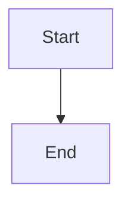
````

The source string is passed through a security validator before being handed to the Mermaid renderer. The validator does NOT parse Mermaid grammar -- it only checks for forbidden patterns. Grammar errors are caught later by the renderer and displayed as an error message.

---

## Supported Diagram Types

### Flowchart

Declared with `graph` or `flowchart` followed by a direction keyword.

**Direction keywords:**

| Keyword | Direction |
|---|---|
| `TD` or `TB` | Top to bottom |
| `LR` | Left to right |
| `BT` | Bottom to top |
| `RL` | Right to left |

**Node shapes:**

| Syntax | Shape | Example |
|---|---|---|
| `A[text]` | Rectangle | `A[Process]` |
| `A(text)` | Rounded rectangle | `A(Start)` |
| `A([text])` | Stadium / pill | `A([Start])` |
| `A[[text]]` | Subroutine | `A[[Subprocess]]` |
| `A[(text)]` | Cylinder (database) | `A[(Database)]` |
| `A((text))` | Circle | `A((Yes))` |
| `A{text}` | Diamond (decision) | `A{Decision?}` |
| `A{{text}}` | Hexagon | `A{{Prepare}}` |
| `A>text]` | Asymmetric (flag) | `A>Event]` |
| `A[/text/]` | Parallelogram | `A[/Input/]` |
| `A[\text\]` | Parallelogram (alt) | `A[\Output\]` |
| `A[/text\]` | Trapezoid | `A[/Wide top\]` |
| `A[\text/]` | Trapezoid (alt) | `A[\Wide bottom/]` |
| `A(((text)))` | Double circle | `A(((Important)))` |

**Edge/link types:**

| Syntax | Description | Example |
|---|---|---|
| `-->` | Arrow | `A --> B` |
| `---` | Line (no arrow) | `A --- B` |
| `-.->` | Dotted arrow | `A -.-> B` |
| `-.-` | Dotted line | `A -.- B` |
| `==>` | Thick arrow | `A ==> B` |
| `===` | Thick line | `A === B` |
| `--text-->` | Arrow with label | `A --yes--> B` |
| `---|text|` | Line with label | `A ---|no| B` |
| `-.text.->` | Dotted arrow with label | `A -.maybe.-> B` |
| `==text==>` | Thick arrow with label | `A ==always==> B` |
| `--text---` | Line with label (alt) | `A --label--- B` |

Labels can also be placed using the pipe syntax on any edge:

```
A -->|label text| B
```

**Chaining:** Multiple connections can be chained in a single line:

```
A --> B --> C --> D
```

**Multiple targets from one node:**

```
A --> B & C --> D
```

This creates edges A->B, A->C, B->D, C->D.

**Minimum example:**

````
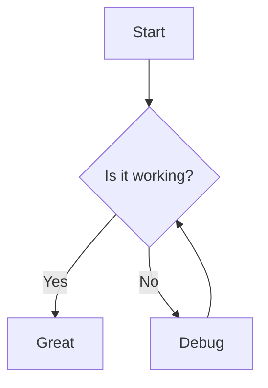
````

---

### Sequence Diagram

Declared with `sequenceDiagram`.

**Participants:** Declare with `participant` or `actor`. The order of declaration sets the left-to-right order on the diagram. If not declared, participants appear in the order they are first mentioned.

```
participant Alice
actor Bob
```

**Aliases:** Give participants a shorter internal name:

```
participant A as Alice
participant B as Bob's Server
```

**Message types:**

| Syntax | Description |
|---|---|
| `A->>B: text` | Solid line with arrowhead |
| `A-->>B: text` | Dotted line with arrowhead |
| `A-xB: text` | Solid line with cross (lost message) |
| `A--xB: text` | Dotted line with cross |
| `A-)B: text` | Solid line with open arrow (async) |
| `A--)B: text` | Dotted line with open arrow (async) |
| `A->>A: text` | Message to self |

**Activations:**

```
activate Alice
deactivate Alice
```

Or shorthand with `+` and `-`:

```
Alice->>+Bob: Request
Bob-->>-Alice: Response
```

**Notes:**

```
Note right of Alice: This is a note
Note left of Bob: Another note
Note over Alice,Bob: Spanning note
```

**Loops:**

```
loop Every minute
    Alice->>Bob: Heartbeat
end
```

**Alternatives (if/else):**

```
alt Success
    Alice->>Bob: 200 OK
else Failure
    Alice->>Bob: 500 Error
end
```

**Optional:**

```
opt Extra response
    Bob-->>Alice: Additional data
end
```

**Parallel:**

```
par Task 1
    Alice->>Bob: Request 1
and Task 2
    Alice->>Charlie: Request 2
end
```

**Critical region:**

```
critical Establish connection
    Alice->>Bob: Connect
option Timeout
    Alice->>Alice: Retry
end
```

**Break:**

```
break When error occurs
    Bob-->>Alice: Error
end
```

**Rect (background highlight):**

```
rect rgb(200, 220, 255)
    Alice->>Bob: Inside highlight
end
```

Note: the `rgb()` syntax works here because it is applied as an SVG fill, not as an HTML element. Use only `rgb(r,g,b)` or `rgba(r,g,b,a)` notation.

**Autonumber:**

```
autonumber
```

Place at the top of the diagram to number all messages sequentially.

**Minimum example:**

````
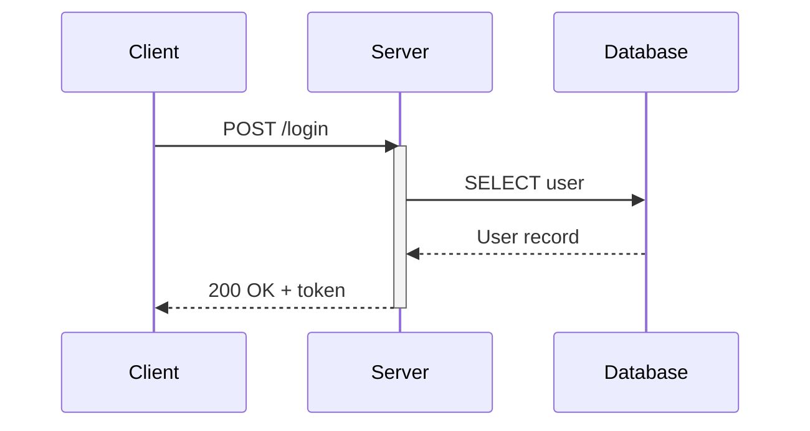
````

---

### Class Diagram

Declared with `classDiagram`.

**Class declaration:**

```
class Animal {
    +String name
    +int age
    +makeSound() void
}
```

**Visibility prefixes:**

| Prefix | Meaning |
|---|---|
| `+` | Public |
| `-` | Private |
| `#` | Protected |
| `~` | Package/internal |

**Method notation:** Append return type after parentheses:

```
+getAge() int
+setName(String name) void
```

**Abstract and static:**

```
+makeSound()* void
+getInstance()$ Animal
```

`*` marks abstract, `$` marks static.

**Relationships:**

| Syntax | Description |
|---|---|
| `A <\|-- B` | Inheritance (B extends A) |
| `A *-- B` | Composition |
| `A o-- B` | Aggregation |
| `A --> B` | Association |
| `A ..> B` | Dependency |
| `A <\|.. B` | Realization (interface) |
| `A -- B` | Link (solid) |
| `A .. B` | Link (dashed) |

**Cardinality (multiplicity):**

```
Customer "1" --> "*" Order : places
```

Place quoted cardinality text before the class names on each end.

**Annotations:**

```
class Shape {
    <<interface>>
}
class Color {
    <<enumeration>>
    RED
    GREEN
    BLUE
}
```

**Namespace (grouping):**

```
namespace com.example {
    class Foo
    class Bar
}
```

**Notes:**

```
note for Animal "This is a base class"
```

**Minimum example:**

````
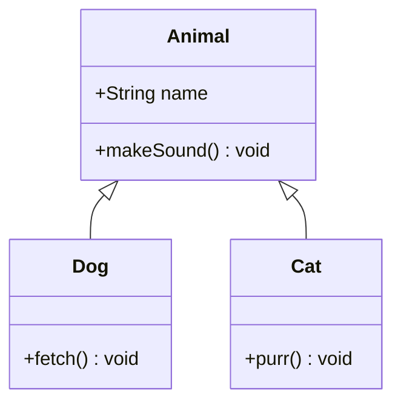
````

---

### State Diagram

Declared with `stateDiagram-v2` (preferred) or `stateDiagram`.

**States and transitions:**

```
[*] --> Idle
Idle --> Processing : start
Processing --> Done : complete
Done --> [*]
```

`[*]` represents the start and end pseudo-states.

**State descriptions:**

```
state "Waiting for input" as Waiting
```

**Composite (nested) states:**

```
state Active {
    [*] --> Running
    Running --> Paused : pause
    Paused --> Running : resume
}
```

**Forks and joins:**

```
state fork_state <<fork>>
state join_state <<join>>

[*] --> fork_state
fork_state --> State1
fork_state --> State2
State1 --> join_state
State2 --> join_state
join_state --> [*]
```

**Choice:**

```
state check <<choice>>
[*] --> check
check --> Valid : is valid
check --> Invalid : is invalid
```

**Notes:**

```
note right of Idle
    System is waiting
    for user input
end note
```

**Concurrency (parallel regions):**

```
state Active {
    [*] --> SubState1
    --
    [*] --> SubState2
}
```

The `--` separator creates concurrent regions within a composite state.

**Minimum example:**

````
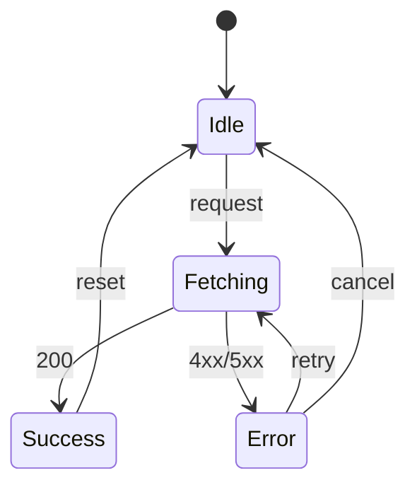
````

---

### Entity Relationship Diagram

Declared with `erDiagram`.

**Entities and attributes:**

```
CUSTOMER {
    int id PK
    string name
    string email UK
}
```

Attribute modifiers: `PK` (primary key), `FK` (foreign key), `UK` (unique key).

**Relationships:**

| Left | Right | Meaning |
|---|---|---|
| `\|\|` | `\|\|` | Exactly one to exactly one |
| `\|\|` | `o\|` | Exactly one to zero or one |
| `\|\|` | `\|{` | Exactly one to one or more |
| `\|\|` | `o{` | Exactly one to zero or more |
| `o\|` | `o\|` | Zero or one to zero or one |
| `o\|` | `\|{` | Zero or one to one or more |
| `o\|` | `o{` | Zero or one to zero or more |

Direction of the relationship line does not matter. Use `--` for identifying relationships or `..` for non-identifying.

```
CUSTOMER ||--o{ ORDER : places
ORDER ||--|{ LINE_ITEM : contains
PRODUCT ||--o{ LINE_ITEM : "is in"
```

The label after `:` describes the relationship.

**Minimum example:**

````
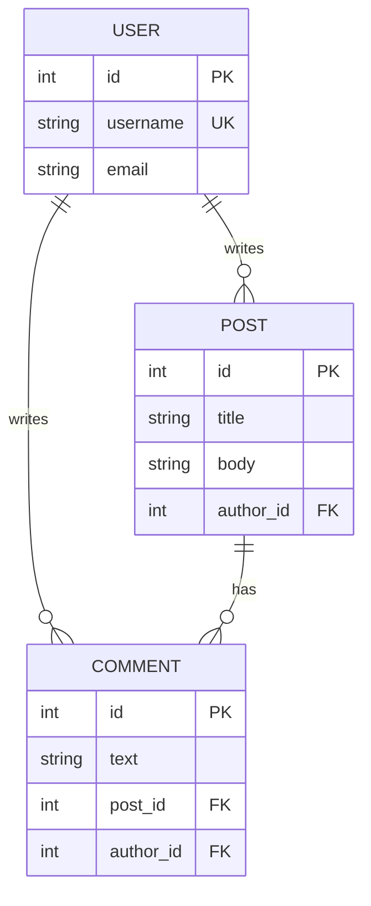
````

---

### Gantt Chart

Declared with `gantt`.

**Header properties:**

```
gantt
    title Project Schedule
    dateFormat YYYY-MM-DD
    axisFormat %b %d
    excludes weekends
```

| Property | Description |
|---|---|
| `title` | Chart title |
| `dateFormat` | Input date format (default `YYYY-MM-DD`) |
| `axisFormat` | Display format on the x-axis (moment.js tokens) |
| `excludes` | Days to skip: `weekends`, specific dates, or day names |
| `todayMarker` | `off` to hide the today line |
| `tickInterval` | Axis tick interval (e.g. `1week`, `1month`) |

**Sections and tasks:**

```
section Planning
    Requirements     :a1, 2024-01-01, 14d
    Design           :a2, after a1, 10d
section Development
    Implementation   :a3, after a2, 30d
    Testing          :a4, after a3, 14d
```

**Task syntax:** `TaskName :taskId, startDate, duration` or `TaskName :taskId, startDate, endDate`

**Task modifiers (placed after the colon, before the id):**

| Modifier | Effect |
|---|---|
| `done` | Task is completed (filled differently) |
| `active` | Task is in progress |
| `crit` | Critical task (highlighted) |
| `milestone` | Zero-duration milestone marker |

Example with modifiers:

```
    Completed task   :done, t1, 2024-01-01, 2024-01-15
    Active task      :active, t2, 2024-01-10, 20d
    Critical task    :crit, t3, after t2, 5d
    Milestone        :milestone, m1, after t3, 0d
```

**Dependencies:** Use `after taskId` as the start date to chain tasks:

```
    Task B :b, after a, 10d
```

**Minimum example:**

````
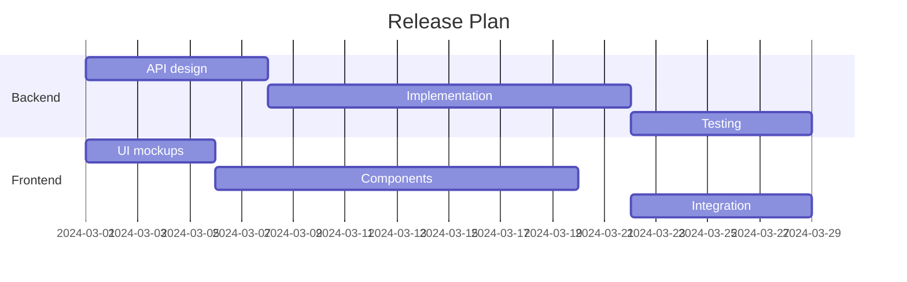
````

---

### Pie Chart

Declared with `pie`.

**Syntax:**

```
pie title Favorite Pets
    "Dogs" : 45
    "Cats" : 30
    "Fish" : 15
    "Birds" : 10
```

Optional `showData` keyword after `pie` to display values:

```
pie showData
    "Category A" : 60
    "Category B" : 40
```

Each entry is `"Label" : value` where value is a number. Labels must be quoted. Values represent proportions (they are normalized to percentages automatically).

**Minimum example:**

````
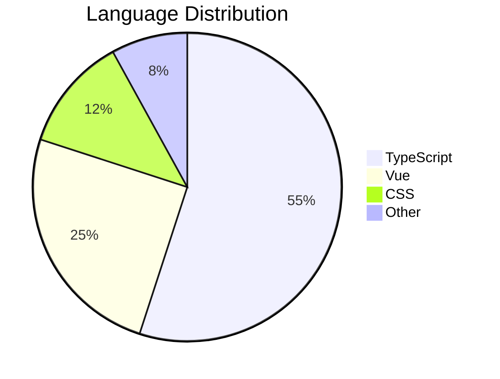
````

---

### Mindmap

Declared with `mindmap`.

Uses indentation to define the tree hierarchy. The root node is at the top level; child nodes are indented beneath their parents.

**Node shapes:**

| Syntax | Shape |
|---|---|
| `Root` | Default (rectangle) |
| `(Rounded)` | Rounded rectangle |
| `((Circle))` | Circle |
| `))Bang((` | Bang (explosion) |
| `)Cloud(` | Cloud |
| `{{Hexagon}}` | Hexagon |
| `[Square]` | Square |

**Syntax:**

```
mindmap
    root((Central Topic))
        Branch 1
            Leaf 1a
            Leaf 1b
        Branch 2
            Leaf 2a
                Sub-leaf
            Leaf 2b
        Branch 3
```

Indentation must be consistent (spaces, not tabs).

**Minimum example:**

````
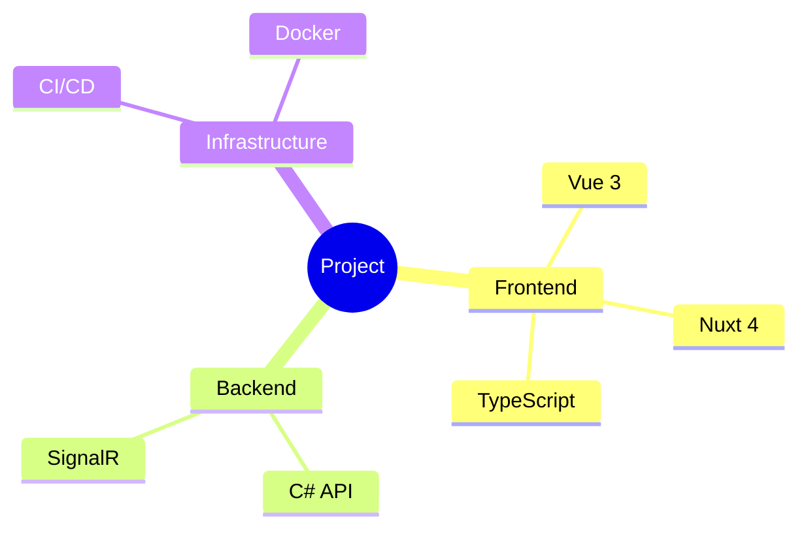
````

---

### Timeline

Declared with `timeline`.

Shows a chronological sequence of events grouped by time period.

**Syntax:**

```
timeline
    title History of Events
    2020 : Event A
         : Event B
    2021 : Event C
    2022 : Event D
         : Event E
         : Event F
```

Each time period line starts with the time label followed by `:` and an event. Additional events for the same period are indented with just `: Event`.

**Minimum example:**

````
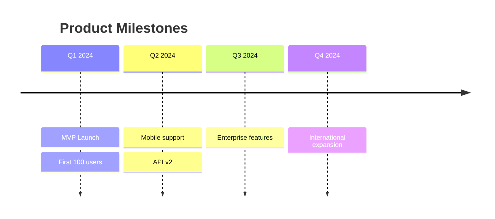
````

---

### Quadrant Chart

Declared with `quadrantChart`.

**Syntax:**

```
quadrantChart
    title Technology Assessment
    x-axis Low Effort --> High Effort
    y-axis Low Impact --> High Impact
    quadrant-1 Do First
    quadrant-2 Schedule
    quadrant-3 Delegate
    quadrant-4 Eliminate
    Item A: [0.8, 0.9]
    Item B: [0.2, 0.7]
    Item C: [0.6, 0.3]
    Item D: [0.1, 0.2]
```

- `x-axis` and `y-axis` define axis labels with `Low Label --> High Label` format
- `quadrant-1` through `quadrant-4` name the four quadrants (1 = top-right, 2 = top-left, 3 = bottom-left, 4 = bottom-right)
- Data points use `Name: [x, y]` where x and y are between 0 and 1

**Minimum example:**

````
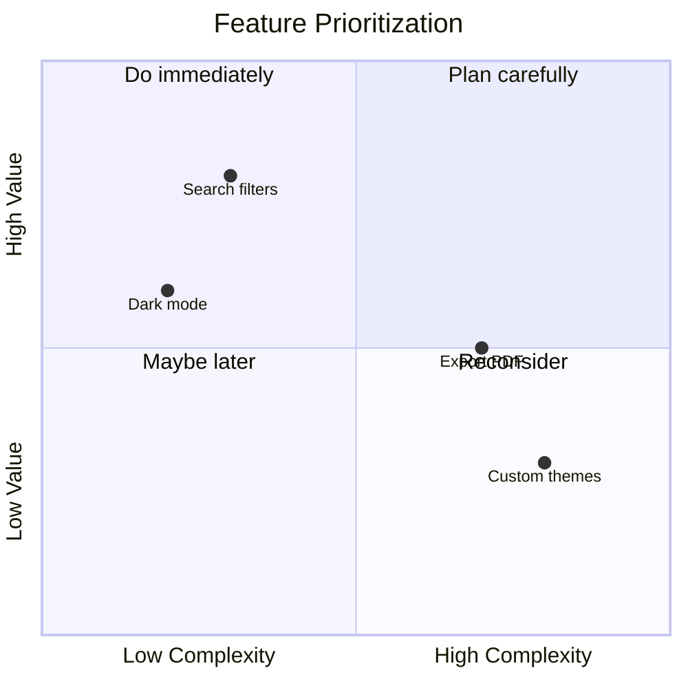
````

---

### Git Graph

Declared with `gitGraph`.

Simulates a git commit history with branches, merges, and cherry-picks.

**Commands:**

| Command | Description |
|---|---|
| `commit` | Add a commit to the current branch |
| `commit id: "msg"` | Commit with a custom label |
| `commit tag: "v1.0"` | Commit with a tag |
| `commit type: HIGHLIGHT` | Highlighted commit |
| `commit type: REVERSE` | Reversed style commit |
| `branch name` | Create and switch to a new branch |
| `checkout name` | Switch to an existing branch |
| `merge name` | Merge a branch into the current branch |
| `merge name id: "msg"` | Merge with a custom label |
| `merge name tag: "v2.0"` | Merge with a tag |
| `cherry-pick id: "abc"` | Cherry-pick a commit by its id |

**Minimum example:**

````
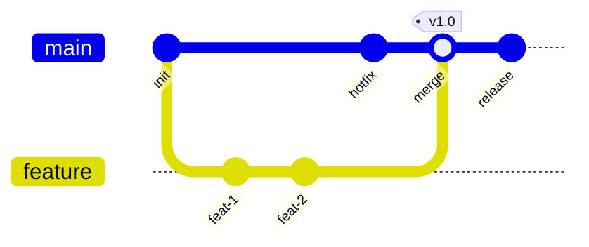
````

---

### C4 Diagram

Uses Mermaid's C4 extension. Declared with `C4Context`, `C4Container`, `C4Component`, or `C4Dynamic`.

**C4Context:**

```
C4Context
    title System Context

    Person(user, "User", "A user of the system")
    System(system, "System", "The main system")
    System_Ext(ext, "External API", "Third-party service")

    Rel(user, system, "Uses")
    Rel(system, ext, "Calls")
```

**C4Container:**

```
C4Container
    title Container Diagram

    Person(user, "User")

    Container_Boundary(sys, "System") {
        Container(web, "Web App", "Vue", "Frontend SPA")
        Container(api, "API", "C#", "Backend service")
        ContainerDb(db, "Database", "PostgreSQL", "Stores data")
    }

    Rel(user, web, "Uses")
    Rel(web, api, "Calls")
    Rel(api, db, "Reads/writes")
```

**Element types:**

| Function | Description |
|---|---|
| `Person(alias, label, desc)` | A person/user |
| `Person_Ext(alias, label, desc)` | External person |
| `System(alias, label, desc)` | A system |
| `System_Ext(alias, label, desc)` | External system |
| `Container(alias, label, tech, desc)` | A container |
| `ContainerDb(alias, label, tech, desc)` | Database container |
| `ContainerQueue(alias, label, tech, desc)` | Queue container |
| `Container_Boundary(alias, label)` | Grouping boundary |
| `Component(alias, label, tech, desc)` | A component |

**Relationships:**

```
Rel(from, to, "label")
Rel(from, to, "label", "technology")
BiRel(a, b, "label")
Rel_D(from, to, "label")  # downward
Rel_U(from, to, "label")  # upward
Rel_L(from, to, "label")  # leftward
Rel_R(from, to, "label")  # rightward
```

**Minimum example:**

````
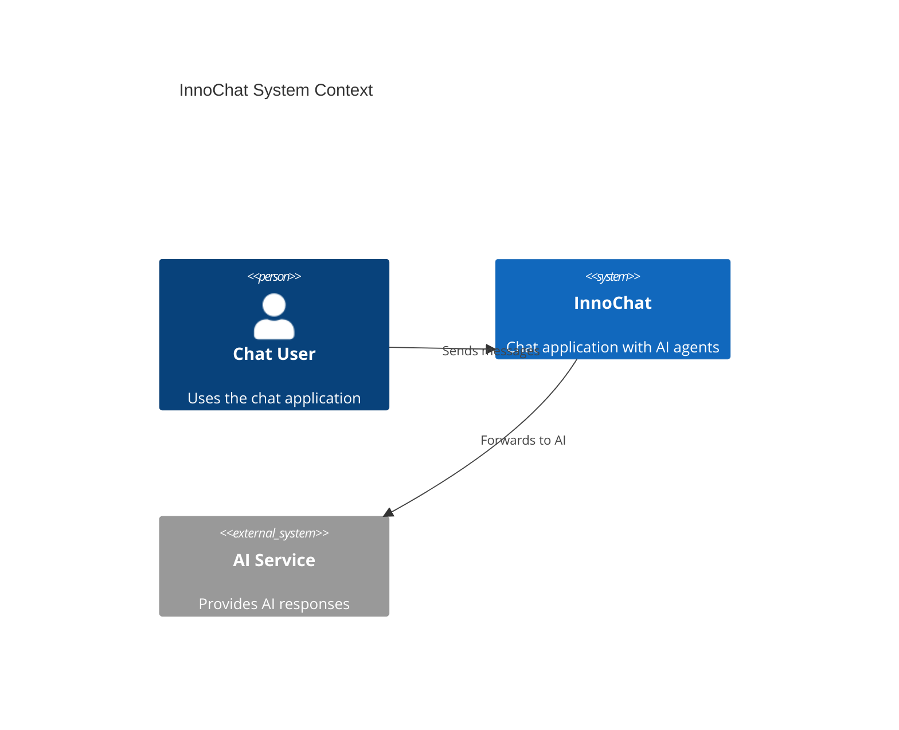
````

---

### Sankey Diagram

Declared with `sankey-beta`.

Shows flows between nodes with proportional width. Each row defines a flow with three comma-separated values: source, target, and value.

**Syntax:**

```
sankey-beta

Source1,Target1,25
Source1,Target2,15
Source2,Target1,10
Source2,Target3,30
```

The first line after `sankey-beta` must be blank. Each subsequent non-blank line is `source,target,value`.

**Minimum example:**

````
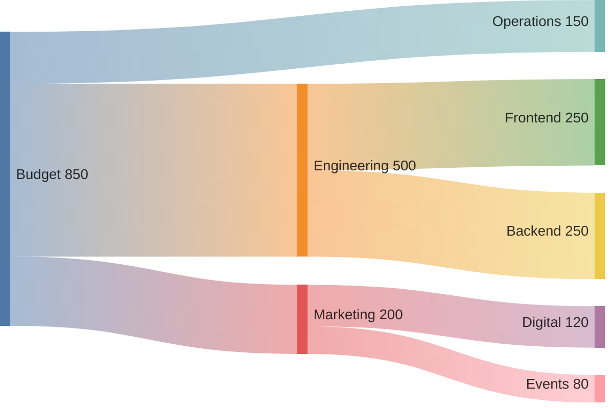
````

---

### Block Diagram

Declared with `block-beta`.

Arranges blocks in a grid layout. Use `columns N` to set the number of columns.

**Syntax:**

```
block-beta
    columns 3
    A["Block A"] B["Block B"] C["Block C"]
    D["Block D"]:2 E["Block E"]
    F["Block F"]:3
```

- `:N` after a block makes it span N columns
- `space` inserts an empty cell
- Block shapes follow the same syntax as flowcharts: `[]`, `()`, `{}`, `(())`, etc.

**Nesting:**

```
block-beta
    columns 2
    block:group1:2
        columns 2
        A B
    end
    C D
```

**Edges (connections between blocks):**

```
A --> B
A -- "label" --> B
```

**Minimum example:**

````
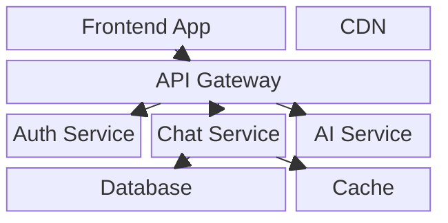
````

---

### Requirement Diagram

Declared with `requirementDiagram`.

Documents requirements and their relationships.

**Element types:**

```
requirement req_name {
    id: REQ-001
    text: The system shall do X
    risk: high
    verifymethod: test
}

functionalRequirement func_req {
    id: REQ-002
    text: Functional requirement text
    risk: medium
    verifymethod: inspection
}

element test_entity {
    type: test case
    docref: TC-001
}
```

**Requirement types:** `requirement`, `functionalRequirement`, `interfaceRequirement`, `performanceRequirement`, `physicalRequirement`, `designConstraint`

**Risk levels:** `low`, `medium`, `high`

**Verify methods:** `analysis`, `demonstration`, `inspection`, `test`

**Relationships:**

```
element - satisfies -> requirement
element - verifies -> requirement
requirement - contains -> requirement
requirement - copies -> requirement
requirement - derives -> requirement
requirement - refines -> requirement
requirement - traces -> requirement
```

**Minimum example:**

````
```mermaid
requirementDiagram

    requirement auth {
        id: REQ-001
        text: Users must authenticate before accessing chat
        risk: high
        verifymethod: test
    }

    functionalRequirement login {
        id: REQ-002
        text: System provides JWT-based login
        risk: medium
        verifymethod: demonstration
    }

    element login_test {
        type: test case
        docref: TC-AUTH-001
    }

    auth - contains -> login
    login_test - verifies -> login
```
````

---

### User Journey

Declared with `journey`.

Maps a user's experience through a process with satisfaction scores.

**Syntax:**

```
journey
    title My Working Day
    section Morning
        Wake up: 3: Me
        Commute: 1: Me, Bus
        Work: 4: Me
    section Afternoon
        Lunch: 5: Me, Colleagues
        Meetings: 2: Me
```

- `section` groups related steps
- Each step is `Step name: score: actors`
- Score ranges from 1 (worst) to 5 (best)
- Actors are comma-separated names

**Minimum example:**

````
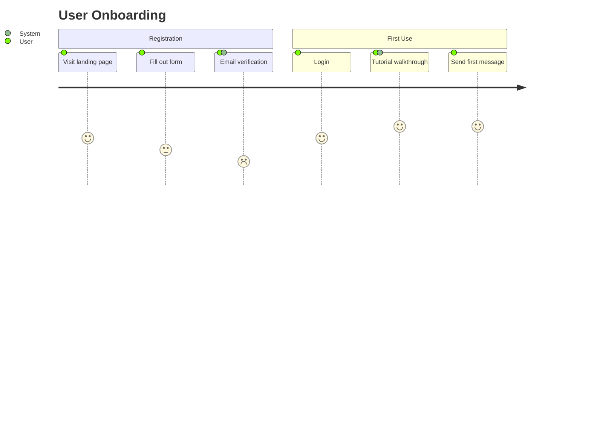
````

---

## Subgraphs (Flowcharts)

Group nodes inside labeled containers. Subgraphs can be nested.

```
graph TD
    subgraph Frontend
        A[Vue App] --> B[Components]
    end
    subgraph Backend
        C[API] --> D[Database]
    end
    B --> C
```

**Subgraph with explicit id:**

```
subgraph sg1 [Display Name]
    ...
end
```

**Direction inside subgraph:**

```
subgraph sg1 [Name]
    direction LR
    A --> B
end
```

---

## Styling (Flowcharts)

### Inline `style` on individual nodes

Apply CSS properties directly to a node by its id:

```
style A fill:#f9f,stroke:#333,stroke-width:2px
style B fill:#bbf,stroke:#00f,color:#fff
```

### `classDef` and `class`

Define a reusable class and assign it to nodes:

```
classDef important fill:#f96,stroke:#333,stroke-width:4px,color:#000
classDef muted fill:#eee,stroke:#999,color:#666

class A important
class B,C muted
```

Or inline with `:::`:

```
A:::important --> B:::muted
```

**Available CSS properties for styling** (applied as SVG attributes):

| Property | Effect |
|---|---|
| `fill` | Background/fill color |
| `stroke` | Border color |
| `stroke-width` | Border width |
| `color` | Text color |
| `stroke-dasharray` | Dashed borders (e.g. `5 5`) |
| `font-weight` | Bold text |
| `font-size` | Text size |
| `rx` | Border radius (rounded corners) |

These work because they are applied directly as SVG presentation attributes, not as HTML CSS. Do NOT use HTML-specific CSS properties.

---

## Comments

Add comments using `%%`:

```
graph TD
    %% This is a comment
    A --> B
```

Only single-line comments starting with `%%` are allowed. Do NOT use `%%{ }%%` -- that is a directive and will be rejected.

---

## Special Characters in Labels

Wrap labels in quotes to include special characters:

```
A["Node with (parens)"]
B["Contains 'quotes'"]
C["Has #semi;colon"]
```

Use HTML entity codes for characters that conflict with Mermaid syntax:

| Character | Entity code |
|---|---|
| `#` | `#35;` or use directly in quoted labels |
| `;` | `#semi;` |
| `"` | `#quot;` within labels |

---

## Validation Limits Summary

| Limit | Value |
|---|---|
| Maximum source size | 50,000 characters |
| Maximum text size (renderer) | 50,000 characters |
| Maximum edges (renderer) | 500 |

---

## What Gets Rejected

| Reason | Trigger | What to avoid |
|---|---|---|
| `oversize` | Source exceeds 50,000 characters | Keep diagrams within the size limit |
| `empty` | Trimmed source is empty | Always include diagram content |
| `external-reference` | Lowercased source contains `//` OR any protocol prefix (`http:`, `https:`, `image:`, `ftp:`, `ftps:`, `ws:`, `wss:`, `file:`, `blob:`, `data:`, `javascript:`, `vbscript:`) | Never include URLs, links, image references, or protocol-relative paths anywhere in the source |
| `directive` | Any line (after trimming leading whitespace) starts with `%%{` or `---` | Never use `%%{init: ...}%%` directives or YAML frontmatter |
| `interactive` | Any line (after trimming leading whitespace) matches `/^click(?:\s\|$)/i` | Never use `click` statements for event handlers, links, or callbacks |
| `html-label` | Source matches `/<\/?[a-z]/i` anywhere | Never use HTML tags in labels (no `<br>`, `<b>`, `<div>`, etc.) |

When a block is rejected, it renders as a plain syntax-highlighted code block -- not a diagram.

### The `//` restriction explained

The external-reference check catches `//` anywhere in the lowercased source. This means **comments with `//` will trigger rejection**. This is intentional -- it catches protocol-relative URLs like `//example.com`. Use `%%` for Mermaid comments instead. Avoid `//` in any label text, note, or description.

### The HTML label restriction explained

The regex `/<\/?[a-z]/i` matches anything that looks like an HTML opening or closing tag. This means labels like `A["Use <br> for breaks"]` or `A["<b>bold</b>"]` will be rejected. Use plain text only in all labels. Line breaks in labels can be achieved using `\n` in some diagram types (e.g. `A["Line 1\nLine 2"]` in flowcharts when htmlLabels is disabled -- but since htmlLabels is always disabled in this renderer, `\n` is the correct approach where supported).

---

## Rendering Details

- **Security level:** `strict` (no inline event handlers, no foreign objects)
- **htmlLabels:** `false` (enforced by both the pre-render validator AND the renderer config)
- **Theme:** `base` with custom theme variables derived from the application's CSS custom properties. The theme adapts automatically to light and dark mode. Do not attempt to configure the theme.
- **Image output:** The rendered SVG is displayed as ``, which sandboxes the SVG (no script execution, no interactivity)
- **Max image height:** `min(70vh, 720px)` with `object-fit: contain`
- **Re-renders:** Automatically on theme change and source change

---

## Complete Examples

### 1. Simple Flowchart

````
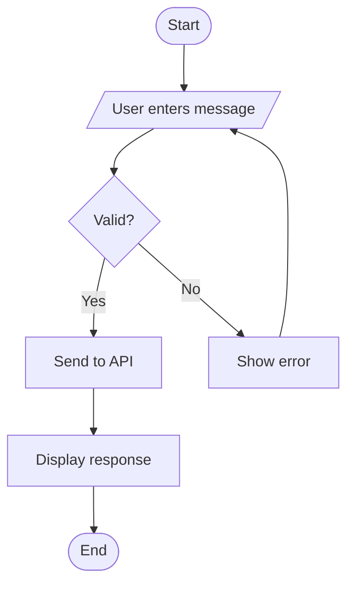
````

### 2. Sequence Diagram with Activation

````
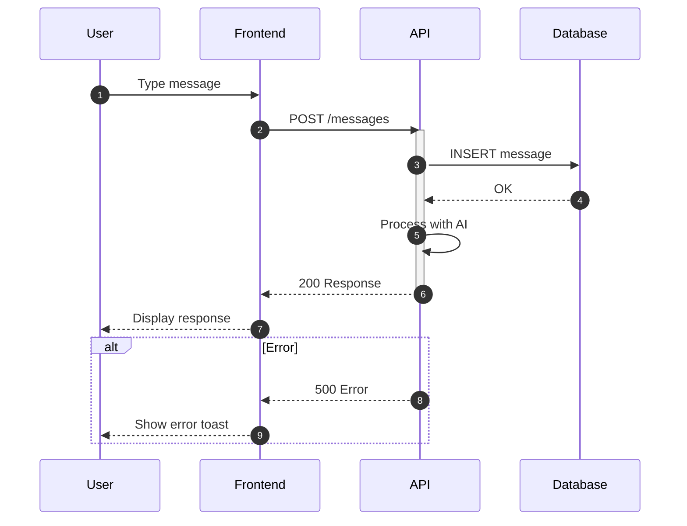
````

### 3. Class Diagram

````
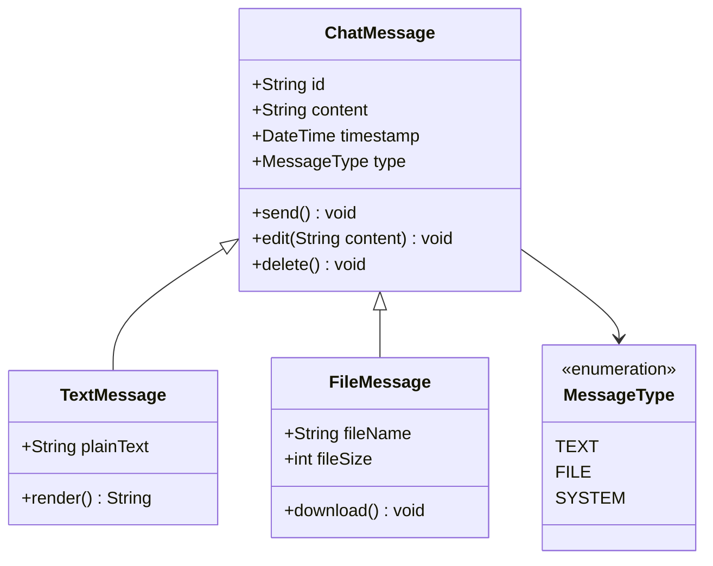
````

### 4. Entity Relationship Diagram

````
```mermaid
erDiagram
    ORGANIZATION {
        int id PK
        string name
        string domain UK
    }
    USER {
        int id PK
        string username UK
        string email
        int org_id FK
    }
    CHAT {
        int id PK
        string title
        datetime created_at
        int org_id FK
    }
    MESSAGE {
        int id PK
        string content
        datetime sent_at
        int chat_id FK
        int sender_id FK
    }
    ATTACHMENT {
        int id PK
        string filename
        string mime_type
        int message_id FK
    }

    ORGANIZATION ||--o{ USER : employs
    ORGANIZATION ||--o{ CHAT : owns
    USER ||--o{ MESSAGE : sends
    CHAT ||--o{ MESSAGE : contains
    MESSAGE ||--o{ ATTACHMENT : has
    USER }o--o{ CHAT : participates
```
````

### 5. Pie Chart

````
```mermaid
pie showData
    title Message Types in Last Month
    "Text messages" : 72
    "File attachments" : 15
    "System notifications" : 8
    "AI responses" : 5
```
````

### 6. Gantt Chart

````
```mermaid
gantt
    title Feature Development Timeline
    dateFormat YYYY-MM-DD

    section Design
        Requirements gathering  :done, req, 2024-01-08, 5d
        UI mockups              :done, mock, after req, 7d
        Design review           :done, rev, after mock, 2d

    section Development
        API endpoints           :active, api, after rev, 10d
        Frontend components     :active, fe, after rev, 12d
        Integration             :integ, after api, 5d

    section Testing
        Unit tests              :test, after fe, 5d
        E2E tests               :e2e, after integ, 4d
        UAT                     :uat, after e2e, 3d

    section Release
        Deployment              :milestone, deploy, after uat, 0d
```
````

### 7. Complex Flowchart with Styling and Subgraphs

````
```mermaid
graph TD
    subgraph Client
        direction LR
        Browser[Browser SPA] --> Store[Pinia Store]
        Browser --> Query[TanStack Query]
    end

    subgraph Server
        direction LR
        API[REST API] --> Auth[Auth Middleware]
        API --> BL[Business Logic]
        BL --> DB[(Database)]
    end

    subgraph Realtime
        SR[SignalR Hub]
    end

    Query -->|REST calls| API
    SR -->|Push updates| Query
    BL -->|Emit events| SR

    classDef client fill:#dbeafe,stroke:#3b82f6,color:#1e3a5f
    classDef server fill:#dcfce7,stroke:#22c55e,color:#14532d
    classDef realtime fill:#fef3c7,stroke:#f59e0b,color:#78350f
    classDef db fill:#f3e8ff,stroke:#a855f7,color:#581c87

    class Browser,Store,Query client
    class API,Auth,BL server
    class SR realtime
    class DB db
```
````

### 8. State Diagram

````
```mermaid
stateDiagram-v2
    [*] --> Disconnected

    state Connected {
        [*] --> Idle
        Idle --> Sending : user sends message
        Sending --> Idle : message delivered
        Sending --> Error : send failed
        Error --> Sending : retry
        Error --> Idle : cancel
    }

    Disconnected --> Connecting : connect
    Connecting --> Connected : success
    Connecting --> Disconnected : timeout
    Connected --> Reconnecting : connection lost
    Reconnecting --> Connected : restored
    Reconnecting --> Disconnected : max retries
    Connected --> Disconnected : logout
```
````

### 9. Mindmap

````
```mermaid
mindmap
    root((InnoChat Architecture))
        Frontend
            Nuxt 4
            Vue 3 Composition API
            TanStack Query
            Pinia Stores
        Backend
            C# Web API
            SignalR
            Authentication
                JWT
                Public mode
        Data
            Messages
            Attachments
            User profiles
        Testing
            Vitest
            Playwright
            MSW
```
````

### 10. User Journey

````
```mermaid
journey
    title New User Chat Experience
    section Discovery
        Find chat app: 3: User
        Read description: 4: User
    section Onboarding
        Create account: 3: User, System
        Verify email: 2: User
        First login: 4: User
    section First Chat
        Start new chat: 5: User
        Send first message: 5: User
        Receive AI response: 5: User, AI
        Share with colleague: 4: User
```
````

---

## Unsupported Features

The following Mermaid features are **not** available through this fence type:

- **Directives** (`%%{init: ...}%%`): Cannot customize theme, font size, or other init options. The renderer uses fixed configuration.
- **YAML frontmatter** (`---` blocks): Rejected by the validator. Cannot set diagram-level config this way.
- **Click handlers** (`click nodeId callback` or `click nodeId href`): All `click` statements are rejected. No interactivity is possible.
- **HTML labels** (`<br>`, `<b>`, `<sub>`, etc.): HTML tags in labels are rejected by the validator. htmlLabels is also set to `false` in the renderer config.
- **Links and URLs**: Any URL or protocol prefix (including `//`) anywhere in the source causes rejection. This includes image references, hyperlinks in nodes, and documentation links.
- **Custom themes via init**: Theme configuration is fixed. The renderer automatically uses appropriate colors for light and dark mode.
- **Interaction callbacks**: No JavaScript callbacks, no event binding. The SVG is rendered as an `` tag so all interactivity is sandboxed away.
- **Icon support** (`:::icon` syntax): Icons require external resources which are not available.
- **External images**: Any `image:` reference is rejected.
- **Zenuml**: While Mermaid supports ZenUML sequence diagrams, the security validator may reject the syntax depending on content.
